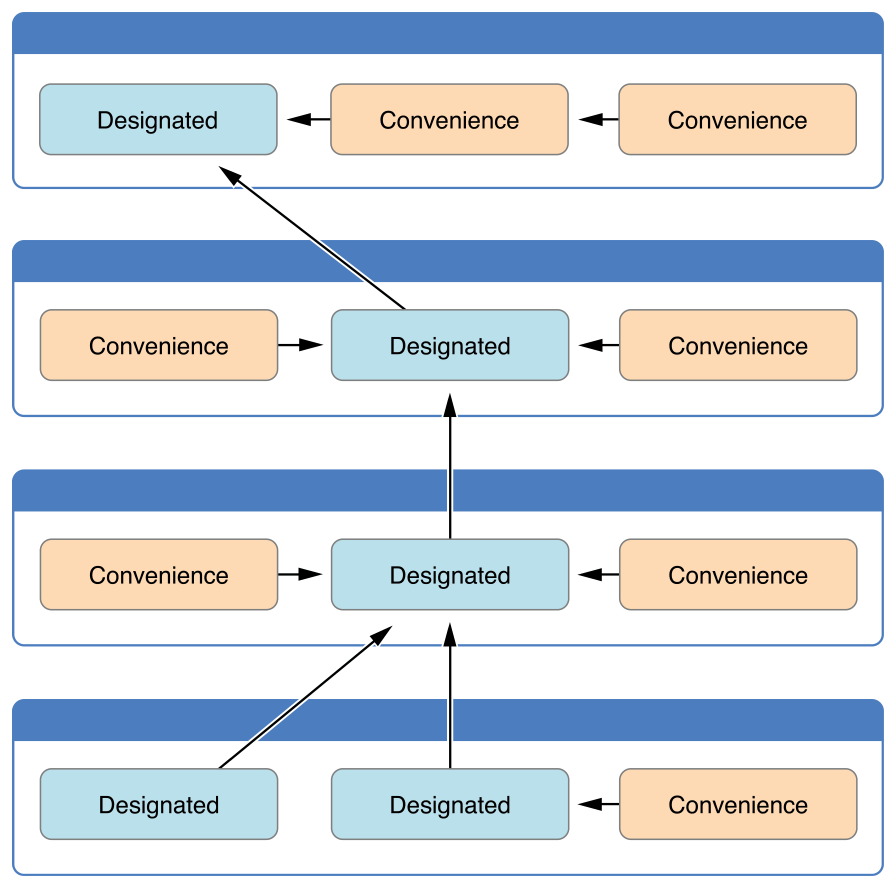

# Swift-CheatSheet

Swift 5 CheatSheet (Rev. 2019-03-25)

Notes taken from [The Swift Programming Language](https://developer.apple.com/library/content/documentation/Swift/Conceptual/Swift_Programming_Language/TheBasics.html#//apple_ref/doc/uid/TP40014097-CH5-ID309).

## Topics

- [The Basics](#the-basics)
- [Basic Operators](#basic-operators)
- [Strings and Characters](#strings-and-characters)
- [Collection Types](#collection-types)
- [Control Flow](#control-flow)
- [Functions](#functions)
- [Closures](#closures)
- [Enumerations](#enumerations)
- [Classes & Structures](#classes--structures)
- [Properties](#properties)
- [Methods](#methods)
- [Subscripts](#subscripts)
- [Inheritance](#inheritance)
- [Initialization](#initialization)
- [Deinitialization](#deinitialization)
- [Optional Chaining](#optional-chaining)
- [Error Handling](#error-handling)
- [Type Casting](#type-casting)
- [Nested Types](#nested-types)
- [Extensions](#extensions)
- [Protocols](#protocols)
- [Generics](#generics)
- [Automatic Reference Counting](#automatic-reference-counting)
- [Access Control](#access-control)
- [Attributes](#attributes)
- [Advanced Operators](#advanced-operators)

\pagebreak

## The Basics

### Constants & Variables

  * Declaring Constants & Variables
      ```swift
      // Constant
      let maximumNumberOfLoginAttempts = 10

      // Variable
      var currentLoginAttempt = 0
      var x = 0.0, y = 0.0, z = 0.0
      ```

  * Type Annotations
    ```swift
    var welcomeMessage: String
    var red, green, blue: Double
    ```

    * Rare that you need to write type annotations
      * If you provide an initial value, Swift can infer the type to be used
  * Naming Constants and Variables
    * Constant/variable names can contain almost any character, including Unicode:
      ```swift
      let π = 3.14159
      let 你好 = "你好世界"
      let  = "dogcow"
      ```

    * If const/var is reserved Swift keyword, surround with back ticks (\`), avoid if you can
  * Printing Constants & Variables
    ```swift
    println(friendlyWelcome)
    println("Current value \(friendlyWelcome)")
    ```

### Comments

```swift
// this is a comment
/* multiple lines comment */
/* /* nested multilines supported */ */
```

### Semicolons

```swift
// No semicolon, unless for multiple statements on a single line
let cat="hello"; println(cat)
```

### Integers

  * Whole numbers with no fractional component, signed or unsigned
  * Swift provides signed & unsigned integers in 8, 16, 32 and 64 bits
    * Follow naming convention similar to C, e.g.
      * UInt8
      * Int32
  * Integer Bounds
    ```swift
    let minValue = UInt8.min // 0
    let maxValue = UInt8.max // 255
    ```

  * **Int**
    * If you don't need specific size, use Int, same size with current platform's native word size
      * 32-bit platform, Int = Int32
      * 64-bit platform, Int = Int64
    * Unless you need to use specific size, always use Int, for codes consistency and interoperability.
    * On 32-bit platform Int values: -2,147,483,648 => 2,147,483,648, large enough
  * **UInt**
    * When you specifically need unsigned integer, else Int is preferred
    * A consistent use of Int aids code interoperability, avoids the need to convert to different number types, matches integer type inference as described in Type Safety and Type Inference

### Floating Point Numbers

  * Numbers with a fractional component, e.g. 3.14159
  * Represent a much wider range of values than integer types
  * Can store numbers much larger/smaller than can be stored in an Int
  * Types:
    * **Double**
      * 64-bit floating point number
        * Use it when floating-point values must be very large or particularly precise
    * **Float**
      * 32-bit floating point number
        * Use it when floating point values do not require 64-bit precision
  * Double has a precision of at least 15 decimal digits, and Float 6 decimal digits

### Type Safety and Type Inference

  * Type safe language
    * Encourages you to be clear about types of values
    * Type checking, compile errors if there is a mismatch
  * Type Inference
    * Does not mean you nave to specify the type of every constant/variable
    * Enables a compiler to deduce the type of a particular expression automatically by examining the values you provide
    * Because of type inference, Swift requires fewer type of declarations than C or Objective-C
    ```swift
    let meaningOfLife = 42    // Inferred as Int
    let pi = 3.14159          // Infered as double, Swift always chooses Double rather than Float
    let anotherPi  = 3 + 0.14 // Also inferred as double
    ```

### Numeric Literals

  * All of these integer literals have a decimal value of 17:
    ```swift
    let decimalInteger = 17
    let binaryInteger = 0b10001   // 17 in binary notation
    let octalInteger = 0o21       // 17 in octal notation
    let hexadecimalInteger = 0x11 // 17 hexa decimal notation
    ```

  * Floating-point literals can be decimal or hexadecimal.They must have a number on both sides of the decimal point
    * Optional exponent, indicated by and uppercase/lowercase e for decimal floats or an p for hexadecimal floats
    * For decimal numbers with an exponent of exp, the base number is multiplied by 10exp:
      ```swift
      1.25e2  // = 1.25 x 102 = 125.0
      1.25e-2 // = 1.25 x 10-2 = 0.0125
      ```

    * For hexadecimal numbers with an exponent of exp, the base is multiplied by 2exp:
      ```swift
      0xFp2 // means 15x22 = 60.0
      0xFp2 // means 15x2-2 = 3.75
      ```

    * All of these floating numbers have a decimal value of 12.1875
      ```swift
      let decimalDouble = 12.1875
      let exponentDouble = 1.21875e1
      let hexDouble = 0xC.3p0
      ```

  * Numeric literals can contain extra formatting to make them easier to read
    * Padded with extra zeroes or contain underscores
    * Not affecting the value:
      ```swift
      let paddedDouble = 000123.456
      let oneMillion = 1_000_000
      let justOverOneMillion = 1_000_000.000_000_1
      ```

### Numeric Type Conversion

  * Overview
    * Use Int for most of the cases
    * Use others only when needed
    * Use others to catch any accidental value overflows & implicitly documents the nature of data being used
  * Integer Conversion
    * Compilation error if a number does not fit into a variable integer type
      ```swift
      let cannotBeNegative: UInt8 = -1
      ```

    * Because of limited range of values, you must opt in to number type conversion on a case-by-case basis
    * Opt-in approach prevents hidden conversion errors
    * To convert:
      ```swift
      * let twoThousand: UInt16 = 2_000
      * let one: UInt 8 - 1
      * let twoThousandAndOne = twoThousand + UInt16(one)
      ```

    * SomeType(ofInitialValue) => default in Swift and pass in an initial value
      * UInt16 has initialiser that accepts a UInt8 value
      * You can't pass in any type here, it has to be a type which UInt16 provides an init
      * Extending inits to cover other types covered in Extensions
  * Integer & Floating Point Conversion
    * Conversion between integer to floating point has to be explicit:
      ```swift
      let three = 3
      let floatNumber = 0.14
      let pi = Double(three) + floatNumber
      let intPi = Int(pi) // 3
      ```

    * Rules for combining numeric constants/variables are different than numeric literals
      ```swift
      let c = 3 + 0.14 // is fine
      ```

      * Because their type is inferred only at the point they are evaluated by the compiler

### Type Aliases

  * Define alternative name for an existing type
  * When you want to refer to an existing type by a name, that is contextually more appropriate
  * When working with data of a specific size from an external source
    ```swift
    typealias AudioSample = UInt16
    var maxAmplitudeFound = AudioSample.min // UInt16.min = 0
    ```

### Booleans

  * **Bool**
    ```swift
    let orangesAreOrange = true
    ```

  * Type safety prevents this:
    ```swift
    let i = 1
    if i { // error }
    if i == 1 { // fine }
    ```

### Tuples

  * Group multiple values into a single compound value
  * Values do not have to be the same type as each other
    ```swift
    let http404Error = (404, "Not found")
    let (statusCode, statusMessage) = http404Error
    let (justStatusCode, _) = http404Error
    println("Status code is \(http404Error.0), message: \(http404Error.1)")
    let http200Status = (statusCode: 200, description: "OK")
    println("Status code: \(http200Status.statusCode)")
    ```

  * Useful to return values of  functions, by returning a tuple with two distinct values, each of a different type the function provides more useful info about its outcome
  * Note
    * Tuples useful for temporary groups of related values, not suited for creation of complex data structures
    * If data structure likely to persist beyond a temp scope, model it as a class or structure.

### Optionals
  * Use **?**
  * Use optional where a value may be present
  * If there is a value, it equals to x, or there isn't a value at all
  * Note
    * Optionals don't exist in C/Obj-C. Nearest is to return nil.
    * Only works for objects, doesn't work for structures, basic C types, and enums.
    * Usually Obj-C methods return a special value NSNotFound to indicate absence of a a value
    * Swift optionals let you indicate the absence of a value for any type at all
      ```swift
      let possibleNumber = "123"
      let convertedNumber = possibleNumber.toInt()  // converted number is inferred to be of type "Int?" or "optional Int"
      ```

      * Because toInt might fail
      * Optional Int is written as Int?
  * nil
    * Set an optional variable to a valueless by assigning to nil
      ```swift
      var serverResponseCode: Int? = 404 // 404
      serverResponseCode = nil  // no value
      ```

    * nil cannot be used with non optional constants/variables
    * If your variables/constants may not have any value, use optional
    * Default to nil
      ```swift
      var surveyAnswer: String? // nil
      ```

    * Note
      * Swift's nil is different from Objective-C's.
      * In Objective-C nil is a pointer to a nonexistent object
      * In Swift it is not a pointer, it is an absence value of a certain type
      * Optionals of any type can be set to nil, not just object types
  * If statements & Forced Unwrapping
    ```swift
    if convertedNumber != nil {
      println("Coverted value: \(convertedValue)!"))
    }
    ```

    * Trying to use ! to access non-existent optional value will trigger an error
  * Optional Binding
    * To find out whether an optional contains a value, if so make the value available as a temporary constant or variable
    * Can be used in if/while statement
      ```swift
      if let constantName = someOptional {
        // statements
      }
      ```

  * Implicitly Unwrapped Optionals
    * Use **!**
    * Sometimes it is clear that an optional will always have a value
    * To remove the need to check and unwrap optional's value every time it is accessed
      ```swift
      let assumedString: String! = "Implicitly unwrapped"
      let implicitString: String = unassumedString

      if assumedString != nil { println(assumedString) }

      if let definiteString = assumedString { ... }
      ```

    * If you try to access an implicitly unwrapped optional when it does not contain value, it will trigger runtime error, same with optional

### Assertions and Preconditions

  * Some cases, not possible for code to continue, use assertions end code execution, to provide an opportunity to debug
    ```swift
    let age = -3
    assert(age >=0, "A person's age cannot be less than 0)
    ```

  * When to use Assertions
    * An integer subscript index is passed to a custom subscript implementation, but the subscript index value could be too low or too high
    * Value passed to a function, check for invalid value
    * An optional value is currently nil, but a non-nil value is essential for subsequent code to execute
  * Assertion cause app to terminate, an effective way to check conditions before app is published

  * Use a precondition whenever a condition has the potential to be false, but must definitely be true for your code to continue execution (i.e. outOfBounds)
    ```swift
    // In the implementation of a subscript...
    precondition(index > 0, "Index must be greater than zero.")
    ```

[Back to top](#swift-cheatsheet)

## Basic Operators

### Overview

  * Operator is a special symbol or phrase that you use to check, change or combine values
  * Supports most standard C operators, and improves several capabilities to eliminate common coding errors
    * Assignment (=) does not return a value, to prevent mistakenly used for ===
    * Arithmetic operators (+, -...) detect and disallow value overflow to avoid unexpected result
    * You can opt-in to value overflow behaviour using Swift's overflow operator in "Overflow Operators"
    * C lets you perform remainder(%) operator on floating numbers
    * Provides two range operators a...<b and a...b

### Terminology

```swift
// Unary
prefix: !b
postfix: i++

// Binary
2 + 3

// Ternary
a ? b : c
```

### Assignment Operator

  ```swift
  let b = 10
  let (x,y) = (1,2)
  if x = y { // invalid }
  ```

  * Does not allow value to be overflow
  * You can option to value overflow behaviour by using
    ```swift
    a &+ b
    ```

  * Addition operator also supported for string "hello " + "world"
  * Two Character values, one char, one String, can be added together
    ```swift
    let dog: Character = ""
    let cow: Character = ""
    let dogCow = dog + cow
    // dogCow is equal to ""
    ```

### Arithmetic Operators

  * Overview
    * Addition (+)
    * Substraction (-)
    * MUltiplication (*)
    * Division (/)
  * Remainder Operator
    * Works out how many multiples b will fit inside a and returns the value that is left over (remainder)
    * Known as modulo operator, its behaviour in Swift for negative numbers, strictly speaking a remainder rather than a modulo operation
    * Formula:
      ```swift
      a % b
      a = (b × some multiplier) + remainder
      ```
    * Example:
      ```swift
      9 % 4 = 1
      -9 % 4 = -1
      9 % -4 = 1
      ```

  * Floating-Point Remainder Calculations
    * Unlike the remainder operator in C or Obj-C, it also works on floating-point numbers:
      ```swift
      8 % 2.5 // = 0.5
      ```

  * Increment & Decrement Operators
    * ++ and ---
      ```swift
      var i = 0
      ++i // i = 1
      ```

    * If used as prefix, it increments the variable before returning its value
    * If used as suffix, it increments the variable after returning its value
      ```swift
      var a = 0
      let b = ++a // b = 1
      let c = a++ // a = 2, but c = 1
      ```

  * Unary Plus Operator
    ```swift
    let three = 3
    let minusTree = -three    // -3
    let plusTree = -minusTree // 3
    ```

    * Prepended without any space
  * Unary Plus Operator
    * Returns the value without any change
      ```swift
      let minusSix = -6
      let alsoMinusSix = +minusSix // -6
      ```

### Compound Assignment Operators

  * +=, -=
    ```swift
    var a = 1
    a += 2 // a = a + 2
    ```

  * Does not return a value

### Comparison Operators

  * Supports all standard C comparison operators
    ```swift
    a == b
    a != b
    a > b
    a < b
    a >= b
    a <= b
    ```
  * In tuples
    ```swift
    (1, "zebra") < (2, "apple")   // true because 1 is less than 2; "zebra" and "apple" are not compared
    (3, "apple") < (3, "bird")    // true because 3 is equal to 3, and "apple" is less than "bird"
    (4, "dog") == (4, "dog")      // true because 4 is equal to 4, and "dog" is equal to "dog"
    ("blue", -1) < ("purple", 1)        // OK, evaluates to true
    ("blue", false) < ("purple", true)  // Error because < can't compare Boolean values
    ```

  * Swift also provides two identity operators **===** and **!==**
    * Test two object references both refer to the same object instance

### Ternary Conditional Operator

  * **question ? answer1 : answer2**

### Nil Coalescing Operator

  * **a ?? b**
  * Unwraps an optional a if it contains a value or returns a default value b if a is nil
  * a is always an optional type
  * Shorthand for
    ```swift
    a != nil ? a! : b
    ```

### Range Operators

  * Closed Range Operator
    * **a...b**
    * Defines a range that runs from a to be, and includes the values of a and b
    ```swift
    for index in 1...5 { ... }
    ```

  * Half-Open Range Operator
    * **a..<b**
    ```swift
    a..<b
    ```

    * Defines a range that runs from a to b, but does not include b
    * Useful when work with zero-based lists, such as arrays
      ```swift
      let names = ["Anna", "Alex", "Brian", "Jack"]
      let count = names.count
      for i in 0..<count {
        println("Person \(i + 1) is called \(names[i])")
      }
      ```
  * One-Sided Range Operator
    * **[x...y]**
    * Continues as far as possible in one direction -for example, a range that includes all the elements of an array
    ```swift
    for name in names[2...] { ... }  // closed 
    for name in names[...2] { ... }  // closed
    for name in names[..<2] { ... }  // half-open
    let range = ...5
    range.contains(7)  // false
    range.contains(4)  // true
    range.contains(-1) // true
    ```

### Logical Operators

  * Logical Not Operator (!a)
    * Inverts Boolean value, true becomes false and vice versa
  * Logical AND Operator (a && b)
  * Logical OR Operator (a || b)
  * Combining Logical Operators
    ```swift
    if enteredDoorCode && passedRetinaScan || hasDoorKey || knowsOverridePassword
    ```

  * Explicit Parantheses
    ```swift
    if (enteredDoorCode && passedRetinaScan) || hasDoorKey || knowsOverridePassword {
    ```
[Back to top](#swift-cheatsheet)

## Strings and Characters

### Overview

  ```swift
  "hello world"
  ```

  * Represented by String, a collection of values of Character type
  * Unicode compliant
  * Swift's string is bridged seamlessly to Foundation's NSString, the entire NSString API is available to call on any String value you create, in addition to the String features described later on.
  * You can also use String value with any API that requires NSString instance
  * More info, check Using Swift with Cocoa & Obj-C

### String Literals

```swift
let someString = "Some string literal value"
let multilineString = """
These is a multiline String. The White Rabbit put on his spectacles.  "Where shall I begin,
please your Majesty?" he asked.
"""
let threeDoubleQuotes = """
Escaping the first quote \"""
Escaping all three quotes \"\"\"
"""
let threeMoreDoubleQuotationMarks = #"""
Here are three more double quotes: """
"""#
```

### Initializing an Empty String

```swift
var emptyString = ""
var anotherEmptyString = String()

emptyString == anotherEmptyString

if emptyString.isEmpty { ... }
```

### String Mutability

You indicate whether a particular String can be modified by assigning it to a variable (can be modified) or to a constant (cannot be modified)
```swift
let constantString = "hello"
constantString += " world"   // compilation error

var variableString = "Horse"
variableString += "and Carriage"  // var is now "Horse and Carriage"

```

### String Are Value Types

  * String value is copied when it is passed to a function or method or
    * when it is assigned to a constant or a variable
  * New copy is created, passed and assigned not the original version
  * Note
    * Different from NSString in Cocoa, it is also pass by reference
  * Behind the scenes, Swift's compiler optimises string usage, so copying only takes place when necessary

### Working with Characters

  * Strings are collection of characters
    ```swift
    for char in "Dog!" { println(char) }
    ```

  * Create a single character
    ```swift
    let yenSign: Character = "¥"
    ```

### Concatenating Strings & Characters

  ```swift
  var welcome = "string1" + "string2"
  welcome.append("!")
  ```

### String Interpolation

  ```swift
  let multiplier = 3
  let message = "\(multiplier) times 2.5 is \(Double(multiplier) * 2.5)"
  print(#"Write an interpolated string in Swift using \(multiplier)."#)
  // Prints "Write an interpolated string in Swift using \(multiplier)."
  print(#"6 times 7 is \#(6 * 7)."#)
  // Prints "6 times 7 is 42."
  ```

### Unicode

  * An international standard for encoding, representing, and processing text in different writing systems
    * Represent characters from any language in standardised form, and to read/write those chars to and from external source such as text file or web page
  * Unicode Scalars
    * Swift's native String type is built from Unicode scalar values.
    * A unique 21-bit number for a character/modifier such as:
      * U+0061 for LATIN SMALL LETTER A ("a")
      * U+1F425 for FRONT-FACING BABY CHICK ("")
    * Note
      * Unicode scalara is any unicode code point in the range of U+0000 to U+D7FF inclusive or U+E000 to U+10FFFF inclusive.
      * Unicode scalars do not include the Unicode surrogate pair code points, which are code points in the range of U+D800 to U+DFFF inclusive
    * Not all 21-bit Unicode scalars are assigned to a char, some are reserved for future assignment
  * Special Unicode Characters in String Literals
    * \0: null character
    * \\: backslash
    * \t: horizontal tab
    * \n: line feed
    * \r: carriage return
    * \": double quote
    * \': single quote
    * An arbitrary unicode scalar, written as \u{n}, where n is between one and eight hexadecimal digits
      ```swift
      "\u{24}"    // $
      "\u{2665}"  // ♥
      "\u{1F496}" //   - Unicode scalar: U+1F496
      ```

  * Extended Grapheme Clusters
    * Every instance of Swift's Character type represents a single extended grapheme cluster
      * A sequence of one or more Unicode scalars that (when combined) produce a single human-readable character
      ```swift
      let eAcute: Character = "\u{E9}"                         // é
      let combinedEAcute: Character = "\u{65}\u{301}"          // e followed by ́eAcute is é, combinedEAcute is é
      ```

    * To represent many complex script characters as a single character value.
      * Hangul syllables from the Korean alphabet, can be represented as either a precomposed or decomposed sequence
      ```swift
      let precomposed: Character = "\u{D55C}"                 // 한
      let decomposed: Character = "\u{1112}\u{1161}\u{11AB}"  // ᄒ, ᅡ,  precomposed is 한, decomposed is 한
      let enclosedEAcute: Character = "\u{E9}\u{20DD}"        // enclosedEAcute is  é⃝
      ```

### Counting Characters

  ```swift
  let unusualMenagerie = "Koala , Snail , Penguin , Dromedary"
  println("unusualMenagerie has \(countElements(unusualMenagerie)) character
  // prints "unusualMenagerie has 40 characters
  ```

  * Use of extended grapheme clusters for Character values means character count may not be affected
    ```swift
    var word = "cafe" +  "\u{301}"  // café
    countElements(word)             // 4
    ```

  * Note
    * The number of chars in a string cannot be calculated without iterating through the whole string, beware of countElements must iterate over the whole string
    * countElements is not the same with length
      * length is based on the number of 16-bit code units within the string's UTF-16 representation, not the number of Unicode extended grapheme clusters within the string
        * To reflect this fact, the length property from NSString is called utf16Count when it is accessed on a Swift String value

### Accessing and Modifying a String

  * String Indices
    * Each String has an associated index type, String.Index which corresponds to the position of each Character
    ```swift
    let greeting = "Guten Tag!"
    greeting[greeting.startIndex] // G
    greeting[greeting.index(before: greeting.endIndex)] // !
    greeting[greeting.index(after: greeting.startIndex)] // u
    let index = greeting.index(greeting.startIndex, offsetBy: 7)
    greeting[index] // a
    ```
  * Inserting and Removing
    ```swift
    var welcome = "hello"
    welcome.insert("!", at: welcome.endIndex)   // hello!
    welcome.insert(contentsOf: " there", at: welcome.index(before: welcome.endIndex)) // hello there!
    welcome.remove(at: welcome.index(before:welcome.endIndex)) // hello there

    let range = welcome.index(welcome.endIndex, offsetBy: -6)..<welcome.endIndex
    welcome.removeSubrange(range) //hello
    ```

### Substrings
```swift
let greeting = "hello, world!"
let index = greeting.index(of: ",") ?? greeting.endIndex
let beginning = greeting[..<index]  // hello
let newString = String(beginning)
```

### Comparing Strings

  * String & Character Equality
    * == and !=
    * Two String values (or two Character values) are considered equal if their extended grapheme clusters are canonically equivalent
      * If they have the same linguistic metalling or appearance, even if they are composed from different Unicode scalars behind the scene
    ```swift
    "\u{E9}" == "\u{65}\u{301}" //  é - true
    "\u{41}" == "\u{0410}" // false - latinCapitalLetterA & cyrillicCapitalLetterA different linguistic meaning
    ```

    * Note
      * String and character comparisons in Swift are not locale sensitive
  * Prefix & Suffix Equality
    * hasPrefix, hasSuffix

### Unicode Representations of Strings

  * UTF-8 Representation
    * When written to a file, Unicode scalars are encoded in one of several Unicode-defined encoding forms.
    * Each form encodes the string in small chunks known as code units, which include:
      * UTF-8 encoding form, as 8-bit code units
      * UTF-16
      * UTF-32
    * Several ways to access Unicode representation of strings
      * Iterate with for-in, access each Character values as Unicode extended grapheme clusters.
      * Access a String value in one of the three Unicode-compliant representation
        * Collection of UTF-8 code units (string's utf8 property)
        * Collection of UTF-16 units (utf16 property)
        * Collection of 21-bit Unitcode scalar values, or equivalent to UTF-32 encoding form (unicodeScalars property)
    * Next is an example different presentation of D, o, g, !! (double exclamation mark, U+203c) and (U+1F436)
      * let dogString = "Dog‼"
  * UTF-8 Representation
    ```swift
    for codeUnit in dogString.utf8 {
      print("\(codeUnit) ")
    }
    print("\n")
    // 68 111 103 226 128 188 240 159 144 182
    //  68, 111, 103 = D, o, g
    //  226, 128, 188 = 3-byte UTF-8 representation of DOUBLE EXCLAMATION MARK character
    //  "240, 159, 144, 182 = 4-byte UTF-8 representation of the DOG FACE
    ```

  * UTF-16 Representation
    ```swift
    for codeUnit in dogString.utf16 {
      print("\(codeUnit) ")
    }
    print("\n")
    // 68 111 103 8252 55357 56374
    // 8252 = decimal equivalent of hexadecimal value of 203C which represent Unicode+203C for double Exclamation Mark, this character represented as a single code unit in UTF-16
    //  55357,  56374 = UTF-16 surrogate pair representation of  the DOG FACE
    ```

      * These values are high-surrogate value of U+83D (55357) and low-surrogate value U+DC36 (56374)
  * Unicode Scalar Representation
    ```swift
    for scalar in dogString.unicodeScalars {
      print("\(scalar.value) ")
      println("\(scalar) ") // print the characters
    }
    print("\n")
    // 68 111 103 8252 128054
    // 8252 = decimal of U+203C = double exclamation mark
    // 128054 = decimal of U+1F436 of the dog face character
    ```
[Back to top](#swift-cheatsheet)

## Collection Types

### Overview
  * **Value types (copied when passed)**
  * Arrays, Sets and Dictionaries
  * Arrays and dictionaries in Swift are always clear about the types of values and keys that they can store.
  * You cannot insert a value of the wrong type
  * Swift's array, sets and dictionaries are implemented as generic collections.

### Mutability of Collections

  * Assign collection to a variable (var) means it is a mutable collection.
  * Assign collection to a constant (let) means it is a immutable collection.

### Arrays

  * Overview
    * Swift's Array differ from Objective-C's NSArray or NSMutableArray which can store any kind of object
    * In Swift, the type of values is always made clear, explicitly or through type inference
  * Array Type Shorthand Syntax
    * **Array<SomeType>** or **[SomeType]** (preferred)
  * Array Creation
    * Literals
    ```swift
    [value 1, value 2, value 3]
    var shoppingList: [String] = ["Eggs", "Milk"]
    ```
    * With Default value
    ```swift
    var threeDoubles = Array(repeating: 0.0, count:3) // [0.0, 0.0, 0.0]
    ```

    * By Adding Two Arrays
    ```swift
    var threeDoubles = Array(repeating: 0.0, count:3) // [0.0, 0.0, 0.0]
    var anotherThreeDoubles = Array(repeating: 2.5, count:3) // [2.5, 2.5, 2.5]
    ```

  * Accessing and Modifying An Array
    ```swift
    var shoppingList: [String] = ["Eggs", "Milk"]
    shoppingList.count
    shoppingList.isEmpty
    shoppingList.append("Flour")
    shoppingList += ["BakingPowder", "Cheese"] // Add new items to an array

    var firstItem = shoppingList[0] // subscript syntax
    shoppingList[0] = "Six eggs"
    shoppingList[4...6] = ["Bananas", "Apples"] // Shopping list now has 4 items
    shoppingList.insert("Maple Syrup", atIndex: 0)

    let mapleSyrup = shoppingList.removeAtIndex(0)
    let apples = shoppingList.removeLast()
    ```

    * Note
      * Subscript can't be used to append a new item to an array
      * Out of range index, cause runtime error
  * Iterating Over an Array
    ```swift
    for item in shoppingList { println(item) }
    ```

    * Enumerate function
      ```swift
      for (index, value) in enumerate(shoppingList) {
        println("Item \(index + 1): \(value)")
      }
      ```

  * Creating and Initialising an Array
    ```swift
    var someInts = [Int]()
    someInts.append(3)
    someInts = [] // reset to empty Int array
    var xyz = [] // runtime error, cause type unknown
    var threeDoubles = [Double](count: 3, repeatedValue: 2.5) // [2.5, 2.5, 2.5]
    ```

### Sets
  * Overview
   * Stores distinct values of same time with no defined ordering
  * Hash Values
   * A type must be hashable in order to be stored in a set
   * Swift’s basic types (String, Int, Double, and Bool) are hashable by default
   * Enumeration case values without associated values are hashable by default
   * Rest of cases, implement 'Hashable' protocol (in turns conforms 'Equatable')
  * Set Type Syntax
    * **Set<ValueType>()**
    * Unlike Arrays and Dictionaries, Sets do not have an equivalent shorthand form.
  * Creating and Initialising
    ```swift
    var letters = Set<Character>()
    letters.insert("a")
    letters = [] // reset to empty set
    ```
  * Set Literals
    ```swift
    var genres: Set<String> = ["Rock", "Classical", "Hip Hop"]
    ```
   * Type is inferred if all elements are of the same type.
    ```swift
    var genres: Set = ["Rock", "Classical", "Hip Hop"]
    ```
    
  * Accessing and Modifying a Set
    ```swift
    genres.isEmpty
    genres.insert("Jazz")
    genres.remove("Rock")
    genres.contains("Funk")
    ```
  * Iterating over a Set
    ```swift
    for genre in genres {}
    ```
  * Set Operations
    * Check more in detail set operations such as, isEqual, isSubset, isSuperset, isDisjoint...

### Dictionaries

  * Overview
    * Swift dictionaries are specific about the types of keys and values
  * Dictionary Type Shorthand Syntax
    * **Dictionary<KeyType, ValueType>** or **[KeyType: ValueType]** (preferred)
  * Dictionary Literals
    ```swift
    [key 1: value 1, key 2: value 2, key 3: value 3]
    var airports: [String: String] = ["TYO": "Tokyo", "DUB": Dublin"]
    ```
    * If key and values are consistent, type definition is inferred
      ```swift
      var airports = ["TYO": "Tokyo", "DUB": "Dublin"]
      ```
  * Creating and Initializing
    ```swift
      var namesOfIntegers = [Int: String]()
      // namesOfIntegers is an empty [Int: String] dictionary
      namesOfIntegers[16] = "sixteen"
      // namesOfIntegers now contains 1 key-value pair
      namesOfIntegers = [:]
      // namesOfIntegers is once again an empty dictionary of type [Int: String]
      ```

  * Accessing and Modifying a Dictionary
    ```swift
    airports.count
    airports.isEmpty
    airports["LHR"] = "London"
    airports.updateValue("Dublin International", forKey: "DUB")
    airports["APL"] = nil
    airports.removeValueForKey("DUB")
    ```

  * Iterating Over a Dictionary
    ```swift
    for (airportCode, airportName) in airports { ... }
    for key in airport.keys { ... }
    for value in airport.values { ... }

    let airportCodes = [String](airports.keys)
    let airportNames = [String](airports.values)
    ```

    * Swift's Dictionary is an unordered collection

  * Hash Values for Dictionary Key Types
    * A type must be hash able to be used as dictionary's key type
    * A hash value is an Int value that is the same for all object that compare equal if a == b, a.hashValue == b.hashValue
    * All Swift's basic types are hash able by default
    * Enumeration member values without associated values are hash able by default
    * Note
      * Make custom typ to conform to Hashable protocol
      * To provide hashValue and "==" operator property implementation
      * hashValue not required to be the same across different executions or in different programs

[Back to top](#swift-cheatsheet)

## Control Flow

### For Loops

  * **For-In**
    * Index is only within the scope of the loop
      ```swift
      for index in 1...5 {
        println("\(index) times 5 is \(index * 5)")
      }
      ```

    * If you don't need the index value
      ```swift
      for _ in 1...power { ... }
      ```

    * You can use for in for array and dictionaries too:
      ```swift
      for name in names { ... }
      for (key, value) in dictionaries { ... }
      ```

    * String character
      ```swift
      for char in "hello" { ... }
      ```

  * **For**
    ```swift
    for var i = 0; i < 3; ++i { ... }
    ```


### While Loops

  * **While**
    ```swift
    while [cond] { ... }
    ```

  * **Repeat-While**
    ```swift
    repeat { ... } while [cond]
    ```


### Conditional Statements

  * **If**
    ```swift
    if [cond] { ... }
    if [cond] { ... } else { ... }
    if [cond] { ... } else if [cond] { ...  }
    ```

  * **Switch**
    ```swift
    let anotherCharacter: Character = "a"
    switch anotherCharacter {
        case "a": // Invalid, the case has an empty body
        case "A":
            print("The letter A")
        case "b","B":
            print("The letter B")
        default:
           print("Not the letter A")
    }
    ```

    * default is a must
  * No Implicit Fall through
    * In contrast with switch statements in C and Objective-C, switch statement in Swift do not fall through the bottom of each case
    * Though break is not required in Swift, you can still use a break statement to match and ignore a particular case or to break out from a case before it is completed
    * Body of each case must contain one executable statement
    * To opt-in for fall through behaviour, use the **fallthough** keyword
  * Interval matching
    ```swift
    let approximateCount = 62
    let countedThings = "moons orbiting Saturn"
    let naturalCount: String
    switch approximateCount {
    case 0:
        naturalCount = "no"
    case 1..<5:
        naturalCount = "a few"
    case 5..<12:
        naturalCount = "several"
    case 12..<100:
        naturalCount = "dozens of"
    case 100..<1000:
        naturalCount = "hundreds of"
    default:
        naturalCount = "many"
    }
    ```

  * Tuples
    * You can use tuple to test multiple values in a switch statement
      ```swift
      let somePoint = (1, 1)

      switch somePoint {
        case (0, 0):
          ....
        case (_, 0):
          ...
        case (0, _):
          ...
        case (-2...2, -2...2):
          ...
        default:
          ...
      }
      ```

  * Value Bindings
    * Bind value or values it matches to temporary constants or variables for use in the body of the case, known as value binding
      ```swift
      switch anotherPoint {
        case (let x, 0):
          ...
        case (0, let y):
          ...
        case let (x, y):
          ...
        }
      ```

    * Note that on this case the default statement is not required, cause every possible case as been catered for
  * **Where**
    * To check additional conditions
    ```swift
    let yetAnotherPoint = (1, -1)
    switch yetAnotherPoint {
    case let (x, y) where x == y:
        print("(\(x), \(y)) is on the line x == y")
    case let (x, y) where x == -y:
        print("(\(x), \(y)) is on the line x == -y")
    case let (x, y):
        print("(\(x), \(y)) is just some arbitrary point")
    }
    ```
  * Compound Cases
  ```swift
    let someCharacter: Character = "e"
    switch someCharacter {
    case "a", "e", "i", "o", "u":
        print("\(someCharacter) is a vowel")
    case "b", "c", "d", "f", "g", "h", "j", "k", "l", "m",
         "n", "p", "q", "r", "s", "t", "v", "w", "x", "y", "z":
        print("\(someCharacter) is a consonant")
    default:
        print("\(someCharacter) is not a vowel or a consonant")
    }
  ```

### Control Transfer Statements

  * **Continue**
    * Tells a loop to stop what it is doing, and start again at the beginning of the next iteration
  * **Break**
    * Break In a Loop Statement
    * Break In a Switch Statement
      * Used to match and ignore one or more cases in switch statement
      * Switch does not allow empty case, to deliberately match & ignore a case
  * **Fallthrough**
    * Switch statements in Swift do not fall through the bottom of each case into the next one
    * To enable fall through the next case use fallthrough keyword
      ```swift
      let integerToDescribe = 5
      var description = "The number \(integerToDescribe) is"
      switch integerToDescribe {
       case 2, 3, 5, 7, 11, 13, 17, 19:
       description += " a prime number, and also"
       fallthrough
      default:
       description += " an integer."
      }
      print(description)
      // Prints "The number 5 is a prime number, and also an integer."
      ```

    * Fallthrough does not check the next condition. It simply causes code execution to move directly to the statements inside the next case.
  * Labeled Statements
    * You can nest switch statement inside another loop statement
    * Sometimes it is important to be explicit which statement you want to break/continue
    * You can mark a loop statement or switch statement with a statement label
    * Format:
      * [label name]:  while [condition] { ... }
      ```swift
      gameLoop: while [condition] {
        switch [variable] {
          case [condition]
            break grameLoop
        }
      }
      ```
  * Early Exit
    * A guard statement, like an if statement, executes statements depending on the Boolean value.
    * You use guard to require that a condition must be true in order for the code after the guard to be executed. 
    * Unlike an if, a guard always has an else clause
    * Using a guard statement for requirements improves the readability of your code, compared to doing the same check with an if statement. It lets you write the code that’s typically executed without wrapping it in an else block, and it lets you keep the code that handles a violated requirement next to the requirement.
    ```swift
    func greet(person: [String: String]) {
        guard let name = person["name"] else {
            return
        }
        
        print("Hello \(name)!")
        
        guard let location = person["location"] else {
            print("I hope the weather is nice near you.")
            return
        }
        
        print("I hope the weather is nice in \(location).")
    }
    ```
  * Checking API Availability
  ```swift
    if #available(iOS 10, macOS 10.12, *) {
      // Use iOS 10 APIs on iOS, and use macOS 10.12 APIs on macOS
    } else {
        // Fall back to earlier iOS and macOS APIs
    }
  ```

[Back to top](#swift-cheatsheet)

## Functions

### Defining and Calling Functions

```swift
func sayHello(personName: String) -> String {
  let greeting = "Hello, " + personName + "!"
  return greeting
}

sayHello("Anna")
```

### Function Parameters & Return Values

  * Functions without Parameters
    ```swift
    func sayHelloWorld() -> String {
      return "hello, world"
    }
    println(sayHelloWorld())
    ```
  * Functions with Multiple Parameters
    ```swift
    func halfOpenRangeLength(start: Int, end: Int) -> Int {
      return end - start
    }
    println(halfOpenRangeLength(1, 10)) // prints "9"
    ```
  * Functions without Return Values
    ```swift
    func sayGoodbye(personName: String) {
      println("Goodbye, \(personName)!")
    }
    sayGoodbye("Dave")
    ```

  * Functions with Multiple Return Values
    ```swift
    func minMax(array: [Int]) -> (min: Int, max: Int) {
      var currentMin = array[0]
      var currentMax = array[0]
      for value in array[1..<array.count] {
        if value < currentMin {
          currentMin = value
        } else if value > currentMax {
          currentMax = value
        }
      }
      return (currentMin, currentMax)
    }

    let bounds = minMax([8, -6, 2, 109, 3, 71])
    bounds.min
    bounds.max
    ```

  * Optional Tuple Return Types
    * -> (Int, Int)?
    * It's different from (Int?, Int?)
    * if let bounds = minMax(...) { ... }

### Function Argument Labels and Parameter Names
 * Each function parameter has both an argument label and a parameter name. 
   * Argument label is used when calling the function; each argument is written in the function call with its argument label before it.
   * Parameter name is used in the implementation of the function. By default, parameters use their parameter name as their argument label.
    ```swift
    func greet(person: String, from hometown: String) -> String {
        return "Hello \(person)!  Glad you could visit from \(hometown)."
    }
    print(greet(person: "Bill", from: "Cupertino"))
    // Prints "Hello Bill!  Glad you could visit from Cupertino."
    ```
      * Consider using external param names when the purpose of a function's argument are not clear
    * Ommiting Argument labels
    ```swift
    func someFunction(_ firstParameterName: Int, secondParameterName: Int) {
    // In the function body, firstParameterName and secondParameterName
    // refer to the argument values for the first and second parameters.
    }
    someFunction(1, secondParameterName: 2)
    ```
  * Default Parameter Values
    * Place params with default values at the end of a function's param list.
    * Ensures that all calls to the func use the same order for their non-default args
      ```swift
        func someFunction(parameterWithoutDefault: Int, parameterWithDefault: Int = 12) {
            // If you omit the second argument when calling this function, then
            // the value of parameterWithDefault is 12 inside the function body.
        }
        someFunction(parameterWithoutDefault: 3, parameterWithDefault: 6) // parameterWithDefault is 6
        someFunction(parameterWithoutDefault: 4) // parameterWithDefault is 12
      ```
  * Variadic Parameters
    * Accepts 0 or more values for a specified type
    * **[someType]...**
      ```swift
      func average(numbers: Double...) -> Double
      average(1, 2, 3, 4, 5)
      ```

    * At most one variadic param, must be as the last in the parameter list
    * If there are default values as well, place variadic param after all the defaulted parameters
  * In-Out Parameters
    * If you want a function to modify a parameter's value, and want the changes to persist.
    * Use **inout** at the start of the parameter definition
    * You can only pass a variable not a constant
    * You place an & before a variable's name when you pass it as an argument
    * Can not have default values, and variadic params can not be marked as inout. If you mark it as inout, you can't mark it as var or let
      ```swift
        func swapTwoInts(_ a: inout Int, _ b: inout Int) {
            let temporaryA = a
            a = b
            b = temporaryA
        }
      ```

### Function Types
  * Function Type as a parameter type for another function
    ```swift
    func printMathResult(mathFunc: (Int, Int) -> Int, a: Int, b:Int) { ... }
    printMathResult(addTwoInts, 3, 5)
    ```
  
  * Function Type as Return Types
    ```swift
    func someFunc(backwards: Bool) -> (Int) -> Int {
      return backwards ? stepBackward : stepForward
    }
    ```

### Nested Functions

```swift
func chooseStepFunction(backwards: Bool) -> (Int) -> Int {
  func stepForward(input: Int) -> Int { return input + 1 }
  func stepBackward(input: Int) -> Int { return input - 1 }
  return backwards ? stepBackward : stepForward
}
```

[Back to top](#swift-cheatsheet)

## Closures

### Overview

  * Three forms:
    * Global functions are closures that have a name and do not capture any values
    * Nested functions are closures that have name and can capture values from their enclosing function
    * Closure expressions are unnamed closures written in a lightweight syntax that can capture values from their surrounding context
  * Swift closures have clean & clear style with optimisations:
    * Inferring parameter and return types from the context
    * Implicit returns from single-expression closures
    * Shorthand argument names
    * Trailing closure syntax

### Closure Expressions

  * A way to write inline closure in a brief focused syntax
  * The Sorted Function
      ```swift
      let names = ["Chris", "Alex", "Ewa", "Barry", "Daniella"]
      func backwards(_ s1: String, _ s2: String) -> Bool { return s1 > s2 }
      var reversedNames = names.sorted(by: backwards)
      ```

  * Closure Expression Syntax
    ```swift
    { ([parameters] -> [return type] in
      [statements]
    }
    ```

    * Can be constant, variable and inout parameters.
    * Default values cannot be provided
    * Variadic parameters can be used
    * Tuples can also be used as parameter types and return types
      ```swift
      reversedNames = names.sorted(by: { (s1: String, s2: String) -> Bool in
        return s1 -> s2
      })
      ```

    * Closure can be written on a single line
  * Inferring Type from Context
    * Because sorting closure is passed as an argument to a function, Swift can infer the types of its parameters and return from the type of the sorted function's second parameter.
      ```swift
      reversedNames = names.sorted(by: { s1, s2 in return s1 > s2 })
      ```

    * You never need to write an inline closure in it fullest form when closure is used as a function argument
    * You can still make types explicit to avoid ambiguity for readers
  * Implicit Returns from Single-Expression Closures
    * Single-expression closures can implicitly return the result of their single expression by omitting the return keyword from their declaration:
      ```swift
      reversedNames = names.sorted(by: { s1, s2 in s1 > s2 })
      ```

  * Shorthand Argument Names
    * **$0**, **$1**, **$2** (refer to the values of the closure’s arguments)
    * You can omit closure's argument list from its definition
    * Number and type of arguments will be inferred from the expected function type.
    * The in keyword can also be omitted because the closure expression is made up entirely of its body
      ```swift
      reversedNames = names.sorted(by: { $0 > $1 })
      ```

  * Operator Functions
    * There's actually an even shorter way to write the closure expression above
    * Swift's String type defines its string specific implementation of the ">" operator as a function that has two parameters of type String, and returns Bool
    * It matches the function type needed for the sorted function
    * Thus Swift can infer that you want to use its string specific implementation:
      ```swift
      reversedNames = names.sorted(by: >)
      ```

### Trailing Closures

  * If you need to pass a closure expression to a function as the function’s final argument and the closure expression is long, it can be useful to write it as a trailing closure instead. 
  * A trailing closure is written after the function call’s parentheses, even though it is still an argument to the function. 
  * Write outside of (and after) the parentheses of the function call it supports:
    ```swift
    func someFunctionThatTakesAClosure(closure: () -> Void) {
        // function body goes here
    }     
    
    // Here's how you call this function without using a trailing closure
    someFunctionThatTakesAClosure(closure: {
        // closure's body goes here
    })     
    
    // Here's how you call this function with a trailing closure instead
    someFunctionThatTakesAClosure() {
        // trailing closure's body goes here
    }
    
    // If a closure expression is provided as the function or method’s ONLY argument and you provide that expression as a trailing closure, you do not need to write a pair of parentheses 
    someFunctionThatTakesAClosure {
        // trailing closure's body goes here
    }
    ```

  * If a closure expression is provided as the function's only argument, you provide that expression as a trailing closure, you can omit a pair of parentheses ()
    ```swift
    reversed = sorted(names) { $0 > $1 }
    ```

    * Map example:
      ```swift
        let strings = numbers.map { (number) -> String in
            var number = number
            var output = ""
            repeat {
                output = digitNames[number % 10]! + output
                number /= 10
            } while number > 0
            return output
        }
        // strings is inferred to be of type [String]
      ```

### Capturing Values

  * Closure capture constants and variables from the surrounding context in which it is defined
  * Closure can refer and modify those values even if the original scope no longer exists
  * Simplest form of a closure in Swift is a nested function
    ```swift
    func makeIncrementor(forIncrement amount: Int) -> () -> Int {
      var runningTotal = 0
      func incrementor() -> Int {
        runningTotal += amount
        return runningTotal
      }
      return incrementor
    }

    let incrementByTen = makeIncrementor(forIncrement: 10)
    incrementByTen() // 10
    incrementByTen() // 20
    ```

  * If you assign a closure to a property of a class instance
    * The closure captures that instance by referring to the instance or its members, this will create strong reference cycle
  * Swift uses capture lists to break these strong reference cycles

### Closures are Reference Types

  * Whenever you assign a function or a closure to a constant or a variable, you are actually setting that constant or variable to be a reference to the function/closure
  * Example above, it is the choice of closure that incrementByTen refers to that is constant, not the contents of the closure itself
  * Meaning if you assign a closure to two different constants/variables, both refer to the same closure
    ```swift
    let alsoIncrementByTen = incrementByTen
    alsoIncrementByTen()
    ```
### Escaping Closures
  * **@escaping** means "Escape from being removed"
  * Whenever the closure is passed as an argument to the function, but is called after the function returns.
  * Write @escaping before the parameter’s type to indicate that the closure is allowed to escape.
  * As an example, many functions that start an asynchronous operation take a closure argument as a completion handler.
    ```swift
    var completionHandlers: [() -> Void] = []
    func someFunctionWithEscapingClosure(completionHandler: @escaping () -> Void) {
        completionHandlers.append(completionHandler)
    }

    someFunctionWithEscapingClosure { self.x = 100 }
    someFunctionWithNonescapingClosure { x = 200 }
    ```
  * Marking a closure with @escaping means you have to refer to self explicitly within the closure.

### Autoclosures

  * Wraps an expression that’s being passed as an argument to a function.
  * It does not take any argument
  * It returns the value of the expression wrapped
  * The code inside isn’t run until you call the closure. Useful for expensive computation under demand.
    ```swift
    var customersInLine = ["Chris", "Alex", "Ewa", "Barry", "Daniella"]
    print(customersInLine.count)
    // Prints "5"
    let customerProvider = { customersInLine.remove(at: 0) }
    print(customersInLine.count)
    // Prints "5"
    print("Now serving \(customerProvider())!")
    // Prints "Now serving Chris!"
    print(customersInLine.count)
    // Prints "4"
    ```
  * If you want an autoclosure that is allowed to escape, use both the **@autoclosure** and **@escaping** attributes. 
    ```swift
    // customersInLine is ["Barry", "Daniella"]
    var customerProviders: [() -> String] = []
    func collectCustomerProviders(_ customerProvider: @autoclosure @escaping () -> String) {
        customerProviders.append(customerProvider)
    }
    collectCustomerProviders(customersInLine.remove(at: 0))
    collectCustomerProviders(customersInLine.remove(at: 0))
    ```

[Back to top](#swift-cheatsheet)

## Enumerations

### Overview

  * Value type (copied when passed)
  * Value can be a String, Character, Integer or Floating-point type
  * Adopt many features traditionally supported only by classes, such as:
    * computed properties to provide additional info about enum's current value
    * instance methods
    * define initialisers to provide an initial member value
    * extended to expand their functionality
    * conform to protocols

### Enumeration Syntax

  ```swift
  enum CompassPoint {
    case North
    case South
    case East
    case West
  }
  ```

  * Swift enumeration members are not assigned with a default integer value when they are created
    * Instead, the different enumeration members are fully fledged values in their own right, with an explicitly defined type of CompassPoint
  * Multiple member values:

    ```swift
    enum Planet {
      case Mercury, Venus, Earth
    }
    ```

  * Each **enum** defines a brand new type
  * Name should start with a capital letter
  * Singular format

    ```swift
    var directionToHead = CompassPoint.West
    ```

  * Once directionToHead is defined, you can use a shorthand notation

    ```swift
    directionToHead = .East
    ```

### Matching Enumeration Values with a Switch Statement

  ```swift
  directionToHead = .South
    switch directionToHead {
      case .North:
        println("N")
      case .South:
        println("S")
      case .East:
        println("E")
      case .West:
        println("W")
      default:
        println("Probably never called")
    }
  ```
  * Switch statement must be exhaustive considering an enumeration's members, if .West is omitted, there'll be a compilation error.

### Iterating

  * Implement **CaseIterable** protocol to access to 'allCases' property
  ```swift
  enum Beverage: CaseIterable {
    case coffee, tea, juice
  }
  let numberOfChoices = Beverage.allCases.count
  print("\(numberOfChoices) beverages available")
  // Prints "3 beverages available"
  ```

### Associated Values

  * Sometimes it is useful to store associated values of other types along with these member values.
  * This enables you to store additional custom info along with the member value, and permit this info to vary each time you use that member in your code.
  * Associated value can be any given type, and the value type can be different for each member of the enumeration
  * Enumerations similar to these are known as discriminated unions, tagged unions and variants in other programming language.

    ```swift
    enum Barcode {
      case UPCA(Int, Int, Int, Int)
      case QRCode(String)
    }
    var productBarCode = Barcode.UPCA(8, 85909, 51226, 3)
    productBarCode = .QRCode("ABCDEF")
    ```

    You extract each associated value as a constant or a variable
    ```swift
    switch productBarcode {
      case .upc(let numberSystem, let manufacturer, let product, let check):
        print("UPC: \(numberSystem), \(manufacturer), \(product), \(check).")
      case .qrCode(let productCode):
        print("QR code: \(productCode).")
    }
    // Prints "QR code: ABCDEFGHIJKLMNOP."
    ```

    If all of the associated values for an enumeration case are extracted as constants, or if all are extracted as variables, you can place a single **var** or **let** annotation before the case name
    ```swift
    switch productBarcode {
      case let .upc(numberSystem, manufacturer, product, check):
        print("UPC : \(numberSystem), \(manufacturer), \(product), \(check).")
      case let .qrCode(productCode):
        print("QR code: \(productCode).")
    }
    // Prints "QR code: ABCDEFGHIJKLMNOP."
    ```

### Raw Values

  * Enumeration members can come repopulated with default values (**rawValue**), which are all of the same type

    ```swift
    enum ASCIIControlCharacter: Character {
      case Tab = "\t"
      case LineFeed = "\n"
      case CarriageReturn = "\r"
    }
    ```

  * Raw value has to be unique, raw value for a particular enumeration number is always the same
  * When integers are used for raw values, they auto-increment

    ```swift
    enum Planet: Int {
      case Mercury = 1, Venus, Earth, Mars, Jupiter, Saturn, Uranus, Neptune
    }

    let earthsOrder = Planet.Earth.rawValue // 3
    let possiblePLanet = Planet(rawValue: 2)
    ```

### Recursive Enumerations
  * Has another enumeration for some case
  * Write **indirect** before a case to indicate a case is recursive.
  * Write **indirect** before the enum to indicate all cases are recursive.
    ```swift
    enum ArithmeticExpression {
        case number(Int)
        indirect case addition(ArithmeticExpression, ArithmeticExpression)
        indirect case multiplication(ArithmeticExpression, ArithmeticExpression)
    }
    
    // if all cases would be indirect...
    indirect enum ArithmeticExpression {
        case number(Int)
        case addition(ArithmeticExpression, ArithmeticExpression)
        case multiplication(ArithmeticExpression, ArithmeticExpression)
    }

    let five = ArithmeticExpression.number(5)
    let four = ArithmeticExpression.number(4)
    let sum = ArithmeticExpression.addition(five, four)
    let product = ArithmeticExpression.multiplication(sum, ArithmeticExpression.number(2))
    ``` 

[Back to top](#swift-cheatsheet)

## Classes & Structures

### Overview

  * Class is **Refence Type**
  * Structure (and Enumeration) are **Value Type**
  * Swift does not require you to create separate interface implementation files for custom classes and structures
  * Thread safe:
  When you pass a class object around your program, you are actually passing a reference to that object, so different parts of your program can share and modify your object. When you pass a structure (or enum), what gets passed around is a copy of the structure. So modifications to structures don’t get shared.
  **One of the major benefits of value types is that they are thread-safe not requiring any synchronization.**

### Comparing Classes and Structures

  * Things in common
    * Define properties
    * Define methods
    * Define subscripts (provide access to their values using subscript syntax)
    * Define initializers
    * Be extended
    * Conform to protocols
  * Classes have additional capabilities that structures don't have:
    * Inheritance
    * Type casting (interpret the type of a class instance at runtime)
    * Deinitializers
    * Reference counting allows more than one reference to a class instance
  * Definition Syntax
    * Similar between Class & Structure
    * Syntax:
      ```swift
      struct Resolution {
        var width = 0
        var height = 0
      }

      class VideoMode {
        var resolution = Resolution()
        var interlaced = false
        var frameRate = 0.0
        var name: String?
      }
      ```

  * Class and Structure Instances
    ```swift
    let someResolution = Resolution()
    let someVideoMode = VideoMode()
    ```

  * Accessing Properties
    ```swift
    someResolution.width // 0
    someVideoMode.resolution.width // 0
    someVideoMode.resolution.width = 1280
    ```
    * Note
      * Unlike Obj-C, Swift enables you to set sub properties of a structure property directly.
      * You are able to set resolution.width directly, without the need to set the entire resolution property
  * Memberwise Initializers for Structure Types
    * Use it to initialise member properties of new structure instances
    * Initial values can be passed to the member wise init by name:

      ```swift
      let vga = Resolution(width: 640, height: 480)
      ```

    * Class does not have default member wise initialiser.

### Structures and Enumerations are Value Types

  * Value type, means its value is copied when ascend to a variable or a constant or when it is passed to a function, including all types in Swift, i.e. integers, floating-point numbers, booleans, etc.

### Classes Are Reference Types

  * Reference types are not copied when they are assigned to a variable/constant or when they are passed to a function. Reference to the same instance is used instead.
  * **Identity Operators**
    * Comparing if two objects are the same instance (**===**)
    * Equal means two instances having the same values (**!==**)
  * **Pointers**
    * A swift constant or variable that refers to an instance is similar to a pointer in C, but is not a direct pointer to an address in memory and does not require you to write an asterisk
    * These references are defined like any other constant/variable in Swift

### Choosing Between Classes and Structures

  * Main recommendations
    * Use structures by default.
    * Use classes when you need Objective-C interoperability.
    * Use classes when you need to control the identity of the data you're modeling.
    * Use structures along with protocols to adopt behavior by sharing implementations.

  * Choose Structures by Default. Choose Classes if the Struct becomes very large or requires inheritance.
    * Structs are much safer and bug-free, especially in a multithreaded environment. Swift value types are kept in the stack. In a process, each thread has its own stack space, so no other thread will be able to access your value type directly. Hence no race conditions, locks, deadlocks or any related thread synchronization complexity.

    * Even though struct and enum don’t support inheritance, they are great for protocol-oriented programming. A subclass inherits all the required and unwanted functionalities from the superclass and is a bad programming practice. Better to use a struct with protocol-oriented programming concept which fixes the above-said issue.

    * Class does support Inheritance. Class is a reference type and is stored in the heap part of memory which makes a class comparatively slower than a struct in terms of performance. Unlike a class, a struct is created on the stack. So, it is faster to instantiate (and destroy) a struct than a class. Unless struct is a class member in which case it is allocated in heap, along with everything else.

    * Value types do not need dynamic memory allocation or reference counting, both of which are expensive operations. At the same time methods on value types are dispatched statically. These create a huge advantage in favor of value types in terms of performance.

  * Use Classes When You Need Objective-C Interoperability.
    * Remember you can’t subclass Swift classes in Objective-C.
    * Remember you can subclass Objective-C classes in Swift, and also adopt Objective-C protocols.
    * Remember to use the **@objc(name)** attribute to provide Objective-C names for properties and methods when necessary.
    * Remember to denote instance (-) and class (+) methods with **func** and **class func**, respectively.
    * Remember to declare simple macros as global constants, and translate complex macros into functions.

  * Use Classes When You Need to Control Identity
  Classes in Swift are reference types. This means that when two different class instances have the same value for each of their stored properties, they're still considered to be different by the identity operator (===).

  * Use Structures When You Don't Control Identity
  Use structures when you're modeling data that contains information about an entity with an identity that you don't control.

  * Use Structures and Protocols to Model Inheritance and Share Behavior
  Structures and classes both support a form of inheritance. Structures and protocols can only adopt protocols; they can't inherit from classes. However, the kinds of inheritance hierarchies you can build with class inheritance can be also modeled using protocol inheritance and structures.

  If you're building an inheritance relationship from scratch, prefer protocol inheritance. Protocols permit classes, structures, and enumerations to participate in inheritance, while class inheritance is only compatible with other classes. When you're choosing how to model your data, try building the hierarchy of data types using protocol inheritance first, then adopt those protocols in your structures.


### Assignment and Copy Behavior for Strings, Arrays, and Dictionaries

  * String, Array, Set, Dictionary types are implemented as structures
  * Different from NSString, NSArray, NSSet, and NSDictionary which are implemented as classes, which are passed by reference.
  * Swift only performs actual copy behind the scenes when absolutely necessary, it manages all value copying to ensure optimal performance

[Back to top](#swift-cheatsheet)

## Properties

### Overview

  * Associate values with a particular class, structure or enumeration
  * Instance Properties
    * Stored Property: provided only by classes and structures
      * Lazy Stored Property: Initial value is not calculated until the first time it is used
    * Computed Property: provided by classes, structures and enumerations.
  * Type Properties
    * Provided by classes, structures and enumerations.
  * You can define property observer, for properties you define or properties that a subclass inherits from its superclass.

### Stored Properties

  * Is a constant (**let**) or variable (**var**) that is stored as part of an instance of a particular class or structure

    ```swift
    struct FixedLengthRange {
      var firstValue: Int
      let length: Int
    }

    var rangeOfThreeItems = FixedLengthRange(firstValue: 0, length: 3)  // the range represents integer values 0, 1, and 2
    rangeOfThreeItems.firstValue = 6 // the range now represents integer values 6, 7, and 8
    ```

  * Stored Properties of Constant Structure Instances
    * When an instance of a Value type (i.e Structure) is marked as a constant, so are all of its properties, but not true for classes.

      ```swift
      let rangeOfFourItems = FixedLengthRange(firstValue: 0, length: 4)
      // this range represents integer values 0, 1, 2, and 3
      rangeOfFourItems.firstValue = 6
      // this will report an error, even though firstValue is a variable property
      ```

  * Lazy Stored Properties
    * Property whose initial value is not calculated until the first time it is used
    * Use **lazy** modifier before its declaration
    * Must always declare lazy as a var
    * Useful for a property that is dependent on outside factors, whose values are not known after an initialisation completes, e.g. computationally expensive
      ```swift
      class DataImporter {
        var fileName = "data.txt"
      }

      class DataManager {
        lazy var importer = DataImporter()
        var data = [String]()
      }

      let manager = DataManager()
      manager.data.append("Some data")
      manager.data.append("Some more data")
      // the DataImporter instance for the importer property has not yet been created
      ```
    * DataImporter instance for the importer property is only created when the importer property is first accessed, e.g.
      * manager.importer.fileName

  * Stored Properties and Instance Variables
    * Obj-C provides two ways to store values and references as apart of a class instance
      * In additional to properties, you can use instance variables as a backing store for values store in a property
    * Swift unifies these concepts into a single property declaration
      * It does not have a corresponding instance variable, and the backing store for a property is not accessed directly
      * To simplify and avoid confusion

### Computed Properties

  * Do not store a value, provides a getter and optional setter to retrieve and set other properties/values directly
    ```swift
    struct Point {
        var x = 0.0, y = 0.0
    }
    struct Size {
        var width = 0.0, height = 0.0
    }
    struct Rect {
        var origin = Point()
        var size = Size()
        var center: Point {
            get {
                let centerX = origin.x + (size.width / 2)
                let centerY = origin.y + (size.height / 2)
                return Point(x: centerX, y: centerY)
            }
            set(newCenter) {
                origin.x = newCenter.x - (size.width / 2)
                origin.y = newCenter.y - (size.height / 2)
            }
        }
    }

    var square = Rect(origin: Point(x: 0.0, y: 0.0),
        size: Size(width: 10.0, height: 10.0))

    let initialSquareCenter = square.center
    square.center = Point(x: 15.0, y: 15.0)
    ```

  * Shorthand Setter Declaration
    * If computed property's setting does not define a name for the new value to be set, **newValue** is used:
      ```swift
      set {
        origin.x = newValue.x - (size.width / 2)
        origin.y = newValue.y - (size.height / 2)
      }
      ```

  * Read-Only Computed Properties
    * Has **get** but no **set**
    * You must declare computed properties, including read only properties as variable properties with **var** keyword, because their value is not fixed.
    * _You can simplify read-only computed property by removing the **get** keyword and its braces_:

    ```swift
    struct Cuboid {
      var width = 0.0, height = 0.0, depth = 0.0
      var volume: Double {
        return width * height * depth
      }
    }

    let fourByFiveByTwo = Cuboid(width: 4.0, height: 5.0, depth: 2.0)
    ```

### Property Observers

  * You can add property observers to:
    * Stored properties excepting lazy stored properties
    * Inherited properties by overriding the property within a subclass
  * Note
    * You don't need to define property observers for non-overridden computed properties, because you can observe and respond to changes to their value directly from within the computed property's setter.
  * You have the option to define either or both of these observers on a property
    * **willSet** - called before the value is stored
      * default param "newValue", you can override
    * **didSet** - called immediately after the new value is stored
      * default old property param name is "oldValue"
  * Note
    * willSet and didSet are not called when a property is first initialised, only called when its value is set outside the initialisation context
    * If you assign a value to a property within its own didSet observer, the new value will replace the one that you just set
      ```swift
      class StepCounter {
        var totalSteps: Int = 0 {
          willSet(newTotalSteps) { }
          didSet { if totalSteps > oldValue { ... } }
        }
      }
      ```
    * If you pass a property that has observers to a function as an in-out parameter, the willSet and didSet observers are always called. This is because of the copy-in copy-out memory model for **in-out** parameters: The value is always written back to the property at the end of the function.

### Global and Local Variables

  * Computing and Observable capabilities are for both Global and Local properties
  * Global variables are defined outside any function, method, closure or type context
  * Global constants and variables are always computed lazily, similar to Lazy Stored Properties
  * Global constants and variables do not need to be marked with 'lazy' modifier
  * Local constants and variables are never computed lazily

### Type Properties

  * Type properties belong to the type itself, not to any one instance of that type. They are useful for defining values that are universal to all instances of a particular type, such as a constant property.
  * For Structures and enumerations (value types), you can define stored and computed type properties,
  * For Classes, you can define computed type properties only
  * Stored type properties for value types can be variables or constants.
    * Computed type properties are always declared as variable properties in the same way as computed instance properties
  * Type Property Syntax
    * In C and Obj-C, you define static constants and variables associated with a type as global static variables
    * In Swift type properties are written as part of type's definition, with "**static**" keyword for value types, and and "**class**" for class types.

      ```swift
      struct SomeStructure {

        static var storedTypeProperty = "Some value."
        static var computedTypeProperty: Int {
            return 1
        }
      }

      enum SomeEnumeration {
        static var storedTypeProperty = "Some value."
        static var computedTypeProperty: Int {
            return 6
        }
      }

      class SomeClass {
        static var computedTypeProperty: Int {
            return 27
        }
        class var overrideableComputedTypeProperty: Int {
            return 107
        }
      }
      ```

    * The computed type property are for read-only, but you can define read-write computed type properties with the same syntax for computed instance properties
  * Querying and Setting Type Properties
    ```swift
    println(SomeClass.computedTypeProperty)
    println(SomeStructure.storedTypeProperty)
    println(SomeStructure.computedTypeProperty)
    println(SomeEnumeration.storedTypeProperty)
    println(SomeEnumeration.computedTypeProperty)
    SomeStructure.storedTypeProperty = "Another value".
    ```

[Back to top](#swift-cheatsheet)

## Methods

### Overview

  * Functions associated with a particular type
  * Classes, structures and enumerations can define instance and type methods (~class methods).
  * Major difference between Swift and Obj-C. In Obj-C, only classes can define methods.

### Instance Methods
  ```swift
  class Counter {
      var count = 0
      func increment() {
          count++
      }
      func increment(by amount: Int) {
          count += amount
      }
      func reset() {
          count = 0
      }
  }
  ```

  * The **self** property
    * self refers to current instance
    * self disambiguates between method parameter and same named instance properties (setter collision)
    ```swift
    struct Point {
      var x = 0.0, y = 0.0
      func isToTheRightOf(x: Double) -> Bool {
        return self.x > x
      }
    }
    ```

  * The **Self** property (capitalized)
    * self refers to the containing type when used inside classes, structs, and enums.
    ```swift
    class ImprovedNetworkManager {
        class var maximumActiveRequests: Int {
            return 4
            }

        func printDebugData() {
          print("Maximum network requests: \(Self.maximumActiveRequests).")
        }
    }
    ```

  * Modifying Value Types from Within Instance Methods
    * Structures and enumeration are value types. By Default properties of a value type cannot be modified from within its instance methods.
    * Mutating method modifies the instance properties and can even assign a completely new instance to self.
    * Use **mutating** keyword before the **func** for the method:
      ```swift
      struct Point {
        var x = 0.0, y = 0.0
        mutating func moveBy(x deltaX: Double, y deltaY: Double) {
          x += deltaX
          y += deltaY
        }
      }

      var somePoint = Point(x: 1.0, y: 1.0)
      somePoint.moveBy(x: 2.0, y: 3.0)
      ```

    * Note that you cannot call a mutating method on constants
      ```swift
      let fixedPoint = Point(x: 3.0, y: 3.0)
      fixedPoint.moveBy(x: 2.0, y: 3.0) // this will report an error
      ```

  * Assigning to Self Within a Mutating Method
      ```swift
      struct Point {
        var x = 0.0, y = 0.0
        mutating func moveByX(deltaX: Double, y deltaY: Double) {
          self = Point(x: x + deltaX, y: y + deltaY)
        }
      }
      ```

    * Mutating methods for enumerations can set the self to a different member of the same enumeration

      ```swift
      enum TriStateSwitch {
        case Off, Low, High
        mutating func next() {
            switch self {
            case Off:
                self = Low
            case Low:
                self = High
            case High:
                self = Off
            }
        }
      }
      var ovenLight = TriStateSwitch.Low
      ovenLight.next() // ovenLight is now equal to .High
      ovenLight.next() // ovenLight is now equal to .Off"
      ```

### Type Methods

  * Syntax:
    * Classes: write keyword **class**
    * Structures and Enumerations: write keyword **static**
    * Self refers to type itself
    * Accessing type methods from the same scope, doesn't require a self:

    ```swift
    class SomeClass {
      class func someTypeMethod() {
        // type method implementation goes here
      }
    }

    SomeClass.someTypeMethod()
    ```
    ```swift
    struct LevelTracker {
      static var highestUnlockedLevel = 1
      var currentLevel = 1
      
      static func unlock(_ level: Int) {
          if level > highestUnlockedLevel { highestUnlockedLevel = level }
      }
      
      static func isUnlocked(_ level: Int) -> Bool {
          return level <= highestUnlockedLevel
      }
      
      @discardableResult // ignore return value
      mutating func advance(to level: Int) -> Bool {
          if LevelTracker.isUnlocked(level) {
              currentLevel = level
              return true
          } else {
              return false
          }
      }
    }
    ```

[Back to top](#swift-cheatsheet)

## Subscripts

### Overview

  * Classes, Structures, Enumerations can define subscripts
  * Shortcuts for accessing the member elements of a collection, list or sequence
  * Use subscripts to set/get values by index without the need for separate methods
    * E.g. **someArray[index]**, **someDictionary[key]**
  * You can define multiple subscripts for a single type
    * Appropriate subscript overload is based on the type of index value passed to the subscript
    * Not limited to a single dimensions
    * You can define multiple input params to suit your custom type's needs

### Subscript Syntax

  * Similar to instance methods, but can be read-write or read-only
    ```swift
    subscript(index: Int) -> Int {
        get { // return an appropriate subscript value here }
        set(newValue) { // perform a suitable setting action here }
    }
    ```

    * As with read-only computed properties, simplify read-only syntax by removing get keyword:
      ```swift
      struct TimesTable {
          let multiplier: Int
          subscript(index: Int) -> Int {
              return multiplier * index
          }
      }

      let threeTimesTable = TimesTable(multiplier: 3)
      println("six times three is \(threeTimesTable[6])") // prints "six times three is 18
      ```

### Subscript Usage

  * Exact meaning of "subscript" depends on the context which it is used
    ```swift
    var numberOfLegs = ["spider": 8, "ant": 6, "cat": 4]
    numberOfLegs["bird"] = 2
    ```

    * Dictionary type implements its key-value subscripting, takes and receives an optional type
      ```swift
      numberofLegs["bird"] returns a value of type Int?
      ```

### Subscript Options

  * Can receive any number of input parameters of any type
  * Can return any type
  * Can use variadic parameters
  * Cannot use in-out params or default parameter values
  * Class and Structure Subscript overloading:
    * more than one subscript if needed inferring types

  ```swift
  struct Matrix {
      let rows: Int, columns: Int
      var grid: [Double]
      init(rows: Int, columns: Int) {
          self.rows = rows
          self.columns = columns
          grid = Array(count: rows * columns, repeatedValue: 0.0)
      }
      func indexIsValidForRow(row: Int, column: Int) -> Bool {
          return row >= 0 && row < rows && column >= 0 && column < columns
      }
      subscript(row: Int, column: Int) -> Double {
          get {
              assert(indexIsValidForRow(row, column: column), "Index out of range")
              return grid[(row * columns) + column]
          }
          set {
              assert(indexIsValidForRow(row, column: column), "Index out of range")
              grid[(row * columns) + column] = newValue
          }
      }
  }
  ```

[Back to top](#swift-cheatsheet)    

## Inheritance

### Overview

  * Classes can add property observers to inherited properties
  * Property observers can be added to any property, stored or computed

### Defining a base class

  * Swift classes do not inherit from a universal base class
    ```swift
    class Vehicle {
        var currentSpeed = 0.0
        var description: String {
            return "traveling at \(currentSpeed) miles per hour"
        }
        func makeNoise() {
            // do nothing - an arbitrary vehicle doesn't necessarily make a noise
        }
    }

    let someVehicle = Vehicle()
    someVehicle.description
    ```

### Subclassing
  ```swift
  class Bicycle: Vehicle {
    var hasBasket = false
  }
  ```

### Overriding

  * Use override keyword to clearly show the intent or error
    * Compiler will also check if you are overriding any of the superclass methods
  * Accessing superclass Methods, Properties, and Subscripts
    * super.someMethod(), super.someProperty, super[someIndex]
  * Overriding Methods
    ```swift
    class Train: Vehicle {
        override func makeNoise() {
            println("Choo Choo")
        }
    }
    ```

  * Overring Properties
    * Overriding property Getters and Setters (regardless property is stored / computed)
      * You can present an inherited read-only property as read-write property
      * You cannot present an inherited read-write property as a read only
      * Note
        * If you provide a setter, you need to provide the getter as well
        * If you don't want to modify the inherited property's value within the overriding getter, just return the super class value, i.e. super.someProperty
        ```swift
        class Car: Vehicle {
          var gear = 1
          override var description: String {
            return super.description + " in gear \(gear)"
          }
        }
        ```
      * You must always declare name and type of overriden property to help the compiler to check validation.

    * Overriding Property Observers
      * Override the property to add the observers
      * Note
        * You cannot add property observers to inherited ('cause cannot be set): 
          * constant stored properties
          * read-only computed properties
        * You cannot override both property observer and setter for the same property
        * If you already provide custom setter, observe any value changes from the setter
      * Example:
        ```swift
        class AutomaticCar: Car {
          override var currentSpeed: Double {
            didSet {
              gear = Int(currentSpeed / 10.0) + 1
            }
          }
        }
        ```

### Preventing Overrides

  * Mark it as **final**, e.g. final var, final func, final class func, final subscript

[Back to top](#swift-cheatsheet)

## Initialization

### Overview

  * Unlike Obj-C inits, Swift inits do not return value
  * Instance of class types can also implement a deinitializer

### Stored Properties

  * Classes and structures must set all their stored properties to an init value by the time an instance is created
  * Stored property initial value set in initialiser or by default value
  * Note
    * When you assign the default value to a stored property, or sets the initial value within the initializers, the property is set directly without calling property observers.
  * Initializers
    ```swift
    init() {
      // perform some initialization here
    }
    struct Fahrenheit {
      var temperature: Double

      init() {
        temperature = 32.0
      }
    }
    ```
  * Stored Constant Properties
    * Can only be modified during init
    * Can only be modified in class init, not sub-class init.

  * Optional Property Types
    * Optional property types are automatically initialised with a value of nil

### Customizing Initialization

  * Parameter Names
    ```swift
    struct Celsius {
        var temperatureInCelsius: Double
        init(fromFahrenheit fahrenheit: Double) {
            temperatureInCelsius = (fahrenheit - 32.0) / 1.8
        }
        init(fromKelvin kelvin: Double) {
            temperatureInCelsius = kelvin - 273.15
        }
    }
    let boilingPointOfWater = Celsius(fromFahrenheit: 212.0)
    let freezingPointOfWater = Celsius(fromKelvin: 273.15)
    ```

  * Argument Labels
    * Use "**_**" as the external name to ommit parameters
      ```swift
      init(_ celsius: Double) {
        temperatureInCelsius = celsius
      }
      Celcius(37.0)
      ```

### Default Initializers

  * If no init is provided, Swift provide default init. Optional parameters will be set to nil
    ```swift
    class ShoppingListItem {
      var name: String? // nil
      var quantity = 1
      var purchased = false
    }
    ```

  * Memberwise Initialisers for Structure Types
    * Structure and Enumeration have initializers methods, same as Classes
    * Structure types automatically receive a member wise initialiser if there is no custom initialisers
    * Memberwise initializer is a shorthand way to initialise the member properties of new structure instances
    * Initial values can be passed to the init by name
      ```swift
      struct Size {
         var width = 0.0, height = 0.0
      }
      let twoByTwo = Size(width: 2.0, height: 2.0)
      ```

### Value Types Initialization

  * Value types (structures and enumerations) do not support inheritance, so they can only delegate to another initialiser
  * self.init can only be called within an initialiser
  * If custom initialiser is defined, you won't have access to the default initialiser
    ```swift
    struct Size {
        var width = 0.0, height = 0.0
    }
    struct Point {
        var x = 0.0, y = 0.0
    }
    struct Rect {
        var origin = Point()
        var size = Size()
        init() {}
        init(origin: Point, size: Size) {
            self.origin = origin
            self.size = size
        }
        init(center: Point, size: Size) {
            let originX = center.x - (size.width / 2)
            let originY = center.y - (size.height / 2)
            self.init(origin: Point(x: originX, y: originY), size: size)
        }
    }

    let basicRect = Rect()
    let originRect = Rect(origin: Point(x: 2.0, y: 2.0),
    ```

  * Note
    * Extensions would be an alternative to initializers

### Class Type Initialization

  * All of class's stored properties must be assigned to an initial value during initialisation
  * **Designated Initializers** & **Convenience Initializers**
    * Designated inits are primary inits for a class
      * Init all properties in that class and calls its superclass chain inits
      * Quite common to have only one
    * Convenience inits, secondary support inits
  * Syntax for Designated and Convenience initialisers
    ```swift
    init ([parameters]) { ... }
    convenience init([parameters]) { ... }
    ```

  * Initializer Delegation for Class Types
    * Rules to simply relationship between designated & convenience inits
      Rule 1. Designated init must call a designated init from its immediate class
      Rule 2. Convenience init must call another init from the same class
      Rule 3. Convenience init must ultimately call a designated init
    
      * Designated init delegates up
      * Convenience init delegates across

      
    
  * Two-Phase Initialization
    * The use of a two-phase initialization process makes initialization safe, while still giving complete flexibility to each class in a class hierarchy. Two-phase initialization prevents property values from being accessed before they are initialized, and prevents property values from being set to a different value by another initializer unexpectedly.
  
  * Phase 1
    * A designated or convenience initializer is called on a class.
    * Memory for a new instance of that class is allocated. The memory is not yet initialized.
    * A designated initializer for that class confirms that all stored properties introduced by that class have a value. The memory for these stored properties is now initialized.
    * The designated initializer hands off to a superclass initializer to perform the same task for its own stored properties.
    * This continues up the class inheritance chain until the top of the chain is reached.
    * Once the top of the chain is reached, and the final class in the chain has ensured that all of its stored properties have a value, the instance’s memory is considered to be fully initialized, and phase 1 is complete.
  * Phase 2
    * Working back down from the top of the chain, each designated initializer in the chain has the option to customize the instance further. Initializers are now able to access self and can modify its properties, call its instance methods, and so on.
    * Finally, any convenience initializers in the chain have the option to customize the instance and to work with self.
  * Safety checks:
    * 1. A designated initializer must ensure that all of the properties introduced by its class are initialized before it delegates up to a superclass initializer.
    * 2. A designated initializer must delegate up to a superclass initializer before assigning a value to an inherited property. If it doesn’t, the new value the designated initializer assigns will be overwritten by the superclass as part of its own initialization.
    * 3. A convenience initializer must delegate to another initializer before assigning a value to any property (including properties defined by the same class). If it doesn’t, the new value the convenience initializer assigns will be overwritten by its own class’s designated initializer.
    * 4. An initializer cannot call any instance methods, read the values of any instance properties, or refer to self as a value until after the first phase of initialization is complete.
  * Initializers Inheritance and Overriding
    * **Swift subclass do not inherit their superclass init by default**
    * If any subclass initializer matches a superclass initializer, "override" modifier is required.
    * If you write subclass init that matches superclass convenience init, superclass convenience init can never be called directly by your subclass, as described in 
      ```swift
      class Vehicle {
        var numberOfWheels = 0
      }

      class Bicycle: Vehicle {
        override init() {
            super.init()
            numberOfWheels = 2
        }
      }

      class Hoverboard: Vehicle {
      var color: String
      init(color: String) {
        self.color = color
        // super.init() implicitly called here
        }
        override var description: String {
          return "\(super.description) in a beautiful \(color)"
        }
      }
      ```

    * Subclasses can modify inherited variable properties during initialization
    * Subclasses cannot modify inherited constants properties during initialization

  * Automatic Initializers Inheritance
    * Rule 1: If your subclass does not define any designated inits, it automatically inherits all its superclass initializers
    * Rule 2: If your subclass provides an implementation of all its superclass designated initialisers (either by inheriting them or by custom implementation), it automatically inherits all of the superclass convenience inits
    * A subclass can implement a superclass designated init as subclass convenience init
  * Designated and Convenience Example
    ```swift
    class Food {
        var name: String
        init(name: String) {
            self.name = name
        }
        convenience init() {
            self.init(name: "[Unnamed]")
        }
    }

    class RecipeIngredient: Food {
        var quantity: Int
        init(name: String, quantity: Int) {
            self.quantity = quantity
            super.init(name: name)
        }
        override convenience init(name: String) {
            self.init(name: name, quantity: 1)
        }
    }

    let oneMysteryItem = RecipeIngredient()
    let oneBacon = RecipeIngredient(name: "Bacon")
    let sixEggs = RecipeIngredient(name: "Eggs", quantity: 6)
    ```
    

  * Failable Initializers
    * A failable initializer **init?** creates an optional value of the type it initializes
    * return nil
      ```swift
      struct Animal {
        let species: String
        init?(species: String) {
            if species.isEmpty { return nil }
            self.species = species
        }
      }
      ```
    * You can override failable init with nofailable one
    * You cannot override nonfailable init failable one
    * You can delegate from **init?** to **init!** and vice versa, and you can override init? with init! and vice versa. You can also delegate from init to init!, although doing so will trigger an assertion if the init! initializer causes initialization to fail.

  * Required Inits
    * Indicates every subclass must implement that initialiser:
      ```swift
      class SomeClass {
        required init() {
          // initializer implementation goes here
        }
      }
      ```
    * You do not write the **override** modifier when overriding:
      ```swift
      class SomeSubclass: SomeClass {
        required init() {
          // subclass implementation of the required initializer goes here
        }
      }
      ```
    * You do not have to provide an explicit implementation if the init can be inherited.

### Init a Default Property Value with a Closure or Function
```swift
class SomeClass {
    let someProperty: SomeType = {
        // create a default value for someProperty inside this closure
        // someValue must be of the same type as SomeType
        return someValue
        } ()
}
```

  * Note
    * If you use closure to init a property, remember the rest of the instance has not been initialised yet
    * You cannot access any other properties, and you cannot use "self"

[Back to top](#swift-cheatsheet)

## Deinitialization

### Overview

  * Called immediately before class dealloc
  * **deinit** keyword, only for class types
  * Not allowed to call a deinit
  * deinits are called automatically
  * Superclass deinit are inherited by their subclasses, and called automatically at the end of a subclass deinit implementation.
  * Superclass deinit are always called, even if a subclass does not provide its own deinitializer.

  ```swift
  class Player {
      deinit {
          // code to deinit
      }
  }
  ```
[Back to top](#swift-cheatsheet)

## Optional Chaining

### Overview

  * Process of querying and calling properties, methods, and subscripts on an optional that might currently be nil
  * If the called entity is nil, it will return nil if not the value

### Optional Chaining as an Alternative to Forced Unwrapping

  * Place a question mark (**?**) after the optional value to chain

    ```swift
    class Person {
        var residence: Residence?
    }

    class Residence {
        var numberOfRooms = 1
    }

    let john = Person()
    john.residence?.address = someAddress  // if residence is nil, the setter is discarded
    let roomCount = john.residence!.numberOfRooms // this trigger a runtime error
    ```

  * Use optional chaining:

    ```swift
    if let roomCount = john.residence?.numberOfRooms {
        println("John's residence has \(roomCount) room(s).")
    } else {
        println("Unable to retrieve the number of rooms.")
    }
    ```

  * Properties
    ```swift
    john.residence?.numberOfRooms 
    ```

  * Methods
    * Methods with no return have an implicit value of Void, it means they return a value of () or an empty tuple.
    * If you call this on an optional value with optional chaining, the return type will be Void? not Void, because return values are always of an optional type when called through optional chaining
      ```swift
      if john.residence?.printNumberOfRooms() != nil { //code... } 
      ```

  * Subscripts
    * For get and set, question mark before the subscript's braces
      ```swift
      if let firstRoomName = john.residence?[0].name " { ... }
      ```
    * If a subscript returns a value of optional type, such as the key subscript of Swift's Dictionary type, question mark after the subscript's closing bracket to chain on its optional return value.
      ```swift
      var testScores = ["Dave": [86, 82, 84], "Bev": [79, 94, 81]]
      testScores["Dave"]?[0] = 91
      testScores["Bev"]?[0]++
      ```

### Linking Multiple Levels of Chaining

  * You can link multiple levels of optional chaining
    * If the type you are trying to retrieve is not optional, it will become optional because of optional chaining
    * If the type you are trying to retrieve is already optional, it will continue be optional
      ```swift
      let johnsStreet = john.residence?.address?.street
      let beginsWithThe = john.residence?.address?.buildingIdentifier()?.hasPrefix("The")
      ```

[Back to top](#swift-cheatsheet)

## Error Handling

### Representing and Throwing Errors
  * Swift enumerations are particularly well suited to modeling a group of related error
    ```swift
    enum VendingMachineError: Error {
      case invalidSelection
      case insufficientFunds(coinsNeeded: Int)
      case outOfStock
    }
    ```
  * Throwing
    ```swift
    throw VendingMachineError.insufficientFunds(coinsNeeded: 5)
    ```
### Handling Errors
There are four ways to handle errors
  * 1. Propagate the Error using **throws**
    ```swift
    // throws error 
    func vend(itemNamed name: String) throws {
        guard let item = inventory[name] else {
            throw VendingMachineError.invalidSelection
        }

        guard item.count > 0 else {
            throw VendingMachineError.outOfStock
        } 
        
        // rest of code
    }

    // propagates the error coming from other function
    func buyFavoriteSnack(person: String, vendingMachine: VendingMachine) throws {
      try vendingMachine.vend(itemNamed: "snackName") // error propagation
    }
    ```

  * 2. **do-Catch**
    ```swift
    do {
        try buyFavoriteSnack(person: "Alice", vendingMachine: vendingMachine)
    } catch VendingMachineError.invalidSelection {
        print("Invalid Selection.")
    } catch VendingMachineError.outOfStock {
        print("Out of Stock.")
    } catch VendingMachineError.insufficientFunds(let coinsNeeded) {
        print("Insufficient funds. Please insert an additional \(coinsNeeded) coins.")
    }

    func nourish(with item: String) throws {
      do {
        try vendingMachine.vend(itemNamed: item)
      } catch is VendingMachineError {
        print("Invalid selection, out of stock, or not enough money.")
      }
    }
    ```

  * 3. Converting Errors to Optionals
    * use **try?** to convert an Error to an Optional value. If an Error is thrown, the value of the expression is nil.
    ```swift
    func someThrowingFunction() throws -> Int {
      // ...
    }
 
    let x = try? someThrowingFunction()
 
    let y: Int?
    do {
        y = try someThrowingFunction()
    } catch {
        y = nil
    }
    ```

  * 4. Disabling Error Propagation
    * Use **try!** if you are sure there will be no error (runtime error otherwise).

### Defer
  * Defer executes just before leaving the current block.
  * Useful for cleaning up
  * Cannot containt break, return or throw an error
  ```swift
  func processFile(filename: String) throws {
    if exists(filename) {
        let file = open(filename)
        defer {
            close(file)
        }
        while let line = try file.readline() {
            // Work with the file.
        }
        // <-- close(file) is called here, at the end of the scope.
    }
  }
  ```

[Back to top](#swift-cheatsheet)

## Type Casting

### Overview

  * A way to check the type of an instance.
  * A way to to treat that instance as if it is a different superclass/subclass from somewhere else in its own hierarchy
  * Implemented with **is** and **as** operators.
    * To check the type of a value or cast a value to a different type
  * Also used to check whether a type conforms to a protocol

### Checking Type

  * **is**: checks whether an instance is a certain subclass type

    ```swift
    var movieCount = 0
    var songCount = 0

    for item in library {
        if item is Movie {
            ++movieCount
        } else if item is Song {
            ++songCount
        }
    }
    ```

### Downcasting

  * Downcast a subclass type with type operator **as**
    * Downcasting can fail, there are two types:
      * **as?**: returns optional value
      * **as**: attempts to downcast and force-unwraps result as a single compound action

    ```swift
    for item in library {
        if let movie = item as? Movie {
            println("Movie: '\(movie.name)', dir. \(movie.director)")
        } else if let song = item as? Song {
            println("Song: '\(song.name)', by \(song.artist)")
        }
    }
    ```

### Type Casting for Any and AnyObject

  * Swift provide two special type for working with non-specific types
    * **Any**: represents an instance of any type at all, including function types.
    * **AnyObject**: represents an instance of any class type.
    ```swift
    var things = [Any]()

    things.append(0)
    things.append(0.0)
    things.append(42)
    things.append(3.14159)
    things.append("hello")
    things.append((3.0, 5.0))
    things.append(Movie(name: "Ghostbusters", director: "Ivan Reitman"))
    ```

[Back to top](#swift-cheatsheet)

## Nested Types

### Overview
  * Available in Classes, Structures and Enums
  * It can be convenient to define utility classes and structures purely for use within the context of a more complex type
    ```swift
    struct BlackjackCard {
        // nested Suit enumeration
        enum Suit: Character {
            case Spades = "♠", Hearts = "♡", Diamonds = "♢", Clubs = "♣"
        }

        // nested Rank enumeration
        enum Rank: Int {
            case Two = 2, Three, Four, Five, Six, Seven, Eight, Nine, Ten
            case Jack, Queen, King, Ace
            // nested struct
            struct Values {
                let first: Int, second: Int?
            }

            var values: Values {
                switch self {
                  case .Ace:
                      return Values(first: 1, second: 11)
                  case .Jack, .Queen, .King:
                      return Values(first: 10, second: nil)
                  default:
                      return Values(first: self.toRaw(), second: nil)
                }
            }
        }
    }

    let heartsSymbol = BlackjackCard.Suit.hearts.rawValue
    // heartsSymbol is "♡"
    ```

[Back to top](#swift-cheatsheet)

## Extensions

### Overview

  * Use **extension**
  * Add new functionality to existing class, structure or enumeration type
  * Extensions can add new functionality, but cannot override existing one
  * Extend types for which you do not have access to the original source code (retroactive modelling)
  * Extensions are similar to categories in Obj-C (Swift ones does not have names).
  * Extensions in Swift can:
    * Define computed instance properties and computed type properties.
    * Define instance methods and type methods.
    * Define convenience initialisers but they cannot add new designated initialisers or deinitializers
    * Define subscripts
    * Define and use new nested types
    * Make an existing type conform to a protocol
    
### Extension Syntax

```swift
extension SomeType {
  // new functionality to add to SomeType goes here
}

// Extend with protocols
extension SomeType: SomeProtocol, AnotherProtocol {
  // implementation of protocol requirements goes here
}
```
  * If you define an extension, the new functionality will be available to all instances, even if they were created before the extension was defined.

### Computed Properties

```swift
// examples with read-only without get for brevity
extension Double {
  var km: Double { return self * 1_000.0 }
  var m: Double { return self }
  var cm: Double { return self / 100.0 }
  var mm: Double { return self / 1_000.0 }
  var ft: Double { return self / 3.28084 }
}
```

### Initializers

```swift
extension Rect {
  init(center: Point, size: Size) {
    let originX = center.x - (size.width / 2)
    let originY = center.y - (size.height / 2)
    self.init(origin: Point(x: originX, y: originY), size: size)
  }
}
```

### Methods

```swift
extension Int {
  func repetitions(task: () -> Void) {
    for _ in 0..<self {
      task()
    }
  }

  mutating func square() {
    self = self * self
  }
}
```

### Subscripts

```swift
extension Int {
  subscript(digitIndex: Int) -> Int {
    var decimalBase = 1
    for _ in 0..<digitIndex {
      decimalBase *= 10
    }
    return (self / decimalBase) % 10
  }
}
```

### Nested Types

```swift
extension Int {
  enum Kind {
    case negative, zero, positive
  }
  var kind: Kind {
    switch self {
      case 0:
        return .zero
      case let x where x > 0:
        return .positive
      default:
        return .negative
    }
  }
}
```

[Back to top](#swift-cheatsheet)

## Protocols

### Overiew

  * Use **protocol**
  * Does not provide an implementation, only describes what an implementation will look like
  * Can be adopted by a class, structure or enumeration
  * Any type that satisfies the requirements conforms to that protocol

### Protocol Syntax

```swift
protocol SomeProtocol {

}

struct SomeStructure: FirstProtocol, AnotherProtocol {

}
class SomeClass: SomeSuperclass, FirstProtocol, AnotherProtocol {

}
```

### Property Requirements

  * Getter & setter requirements

    ```swift
    protocol SomeProtocol {
      var mustBeSettable: Int { get set }       // may be stored or computed
      var doesNotNeedToBeSettable: Int { get }  // may be stored or computed
    }
    ```

  * Type property protocol. Use **static** keyword

    ```swift
    protocol AnotherProtocol {
      static var someTypeProperty: Int { get set }
    }
    ```

### Method Requirements

  * Allowed Variadic parameters
  * Not allowed Default values
  * If you mark a protocol instance method requirements as mutating, you do not need to write the mutating keyword when writing an implementation of that method for a class. Mutating only used on value types (i.e. structures and enumerations)
    ```swift
    protocol SomeProtocol {
        func random() -> Double
        static func someTypeMethod()
        mutating func someMutatingMethod()
    }
    ```

### Initializer Requirements
  * Class implementations of Protocol initialisers requirements
    * Use **required** modifier for both designated and convenience inits:
      ```swift
      protocol SomeProtocol {
        init(someParameter: Int)
      }

      class SomeClass: SomeProtocol {
        required init(someParameter: Int) {
          // initializer implementation goes here
        }
      }
      ```

  * Subclass implementation (note the override):

    ```swift
    protocol SomeProtocol {
        init()
    }

    class SomeSuperClass {
        init() {
            // initializer implementation goes here
        }
    }

    class SomeSubClass: SomeSuperClass, SomeProtocol {
        // "required" from SomeProtocol conformance; "override" from SomeSuperClass
        required override init() {
            // initializer implementation goes here
        }
    }
    ```

### Protocols as Types

  * You can use protocol in many places, including:
    * As a parameter type or return type in a function, method or init
    * As a type of a constant, variable or property
    * As a type of items in an array, dictionary or other container

    ```swift
    class Dice {
        let generator: SomeGeneratorProtocol
        init(sides: Int, generator: SomeGeneratorProtocol) {
            self.generator = generator
        }
    }
    ```

### Delegation

  * Implemented by defining a protocol that encapsulates the delegated responsibilities

  ```swift
  protocol DiceGame {
      var dice: Dice { get }
      func play()
  }

  protocol DiceGameDelegate {
      func gameDidStart(game: DiceGame)
      func game(game: DiceGame, didStartNewTurnWithDiceRoll diceRoll: Int)
      func gameDidEnd(game: DiceGame)
  }

  class SnakesAndLadders: DiceGame {
      let finalSquare = 25
      let dice = Dice(sides: 6, generator: LinearCongruentialGenerator())
      var square = 0
      var board: [Int]
      init() {
          board = [Int](count: finalSquare + 1, repeatedValue: 0)
          board[03] = +08; board[06] = +11; board[09] = +09; board[10] = +02
          board[14] = -10; board[19] = -11; board[22] = -02; board[24] = -08
      }
      var delegate: DiceGameDelegate?
      func play() {
          square = 0
          delegate?.gameDidStart(self)
          gameLoop: while square != finalSquare {
              let diceRoll = dice.roll()
              delegate?.game(self, didStartNewTurnWithDiceRoll: diceRoll)
              switch square + diceRoll {
              case finalSquare:
                  break gameLoop
              case let newSquare where newSquare > finalSquare:
                  continue gameLoop
              default:
                  square += diceRoll
                  square += board[square]
              }
          }
          delegate?.gameDidEnd(self)
      }
  }

  class DiceGameTracker: DiceGameDelegate {
      var numberOfTurns = 0
      func gameDidStart(game: DiceGame) {
          numberOfTurns = 0
          if game is SnakesAndLadders {
              println("Started a new game of Snakes and Ladders")
          }
          println("The game is using a \(game.dice.sides)-sided dice")
      }
      func game(game: DiceGame, didStartNewTurnWithDiceRoll diceRoll: Int) {
          ++numberOfTurns
          println("Rolled a \(diceRoll)")
      }
      func gameDidEnd(game: DiceGame) {
          println("The game lasted for \(numberOfTurns) turns")
      }
  }

  let tracker = DiceGameTracker()
  let game = SnakesAndLadders()
  game.delegate = tracker
  game.play()
  ```

### Adding Protocol Conformance with an Extension

  * You can extend existing type to adopt and conform to a new protocol, even if you do not have access to the source code.
  * Extensions can add new properties, methods, and subscripts to an existing type, and are therefore able to add any requirements that a protocol demand.

    ```swift
    protocol TextRepresentable {
      func asText() -> String
    }

    extension Dice: TextRepresentable {
      func asText() -> String {
        return "A \(sides)-sided dice"
      }
    }
    ```

  * Declaring Protocol Adoption with Extension
    * If a type already conforms to a protocol, but has not adopted that protocol you can make it adopt the protocol with an empty extension:

      ```swift
      struct Hamster {
        var name: String

        func asText() -> String {
          return "A hamster named \(name)"
        }
      }

      extension Hamster: TextRepresentable {}

      let simonTheHamster = Hamster(name: "Simon")
      let somethingTextRepresentable: TextRepresentable = simonTheHamster
      print(somethingTextRepresentable.textualDescription)
      // Prints "A hamster named Simon"
      ```

    * Note
      * Types do not automatically adopt a protocol  by just satisfying its requirements, they must explicitly declare their adoption of the protocol

### Collections of Protocol Types

  * Protocol can be used as the type to be stored in collection as as array/dictionary:

    ```swift
    let things: [TextRepresentable] = [game, d12, simonTheHamster]
    for thing in things {
        println(thing.asText())
    }
    ```

### Protocol Inheritance

  * Protocol can inherit one or more other protocols and can add further requirements on top of the requirements it inherits:

    ```swift
    protocol InheritingProtocol: SomeProtocol, AnotherProtocol {
        // protocol definition goes here
    }

    protocol PrettyTextRepresentable: TextRepresentable {
        func asPrettyText() -> String
    }
    ```

### Class-Only Protocol

  * Limit protocol adoption to class types (and not structures or enumerations) by adding the class keyword to a protocol's inheritance list:
    ```swift
    protocol SomeClassOnlyProtocol: class, SomeInheritedProtocol {
      // class-only protocol definition goes here
    }
    ```

  * Note
    * Use a class-only protocol when the behaviour defined that protocol's requirements assumes or requires that a conforming type has reference semantics rather than value semantics.

### Protocol Composition

  * You can combine multiple protocols into a single protocol composition.
    * **protocol<SomeProtocol, AnotherProtocol>**
    ```swift
    protocol Named {
        var name: String { get }
    }
    protocol Aged {
        var age: Int { get }
    }
    struct Person: Named, Aged {
        var name: String
        var age: Int
    }
    func wishHappyBirthday(celebrator: protocol<Named, Aged>) {
        println("Happy birthday \(celebrator.name) - you're \(celebrator.age)!")
    }
    let birthdayPerson = Person(name: "Malcolm", age: 21)
    wishHappyBirthday(birthdayPerson)  // prints "Happy birthday Malcolm - you're 21!"
    ```

  * Note
    * Protocol compositions do not define a new, permanent protocol type, rather they define a temporary local protocol that has the combined requirements of all protocols in the composition.

### Protocol Conformance
  * **is** operator returns true if an instance conforms to a protocol and returns false if it does not.
  * **as?** returns an optional value of the protocol’s type, and this value is nil if the instance does not conform to that protocol.
  * **as!** forces the downcast to the protocol type and triggers a runtime error if the downcast does not succeed.
    ```swift
    protocol HasArea {
      var area: Double { get }
    }

    for object in objects {
        if let objectWithArea = object as? HasArea {
            println("Area is \(objectWithArea.area)")
        } 
    }
    ```

### Protocol Extensions
  * Protocols can be extended to provide method and property implementations to conforming types
  * Protocols can provide default implementations of a required method or property

    ```swift
    extension RandomNumberGenerator {
        var randomVariable: Bool { return randomBool() } // var inherited by other protocol
        func randomBool() -> Bool {
          return random() > 0.5
        }
    }
    ```

### Protocol Constraints
  * Use **where** keyword
    ```swift
    extension Collection where Iterator.Element: TextRepresentable {
        var textualDescription: String {
            let itemsAsText = self.map { $0.textualDescription }
            return "[" + itemsAsText.joined(separator: ", ") + "]"
        }
    }
    ```

[Back to top](#swift-cheatsheet)

## Generics

### Overview

  * Enables you to write flexible, reusable functions and types that can work with any type, subject to requirements that you define.
  * Avoid duplication and expresses its intent in a clear, abstracted manner
  * Most powerful feature of Swift, much of the Swift standard library is built with generic code.
 
### Generic Functions

  ```swift
  // inout means that modifying the local variable will also modify the passed-in parameters.
  func swapTwoValues<T>(inout a: T, inout b: T) {
      let temporaryA = a
      a = b
      b = temporaryA
  }

  var someInt = 3
  var anotherInt = 107
  swapTwoValues(&someInt, &anotherInt)

  var someString = "hello"
  var anotherString = "world"
  swapTwoValues(&someString, &anotherString)
  ```

### Type Parameters

  * In the swapTwoValues, the placeholder T is an example of a type parameter.
    * Once you specify the type parameter, you can use it to define the type of a function's parameter, function's return type and or as a type annotation within the body of the function
    * You can provide more than one type parameter by writing type parameter name within the angle bracket.
  * Naming Type Parameters
    * Traditional to use single-character name **T**, but you can use any valid identifier for the type parameter name with Capital letter (Array<**Element**>)
    * Allowed generic types with multiple parameters (Dictionary<**Key, Value**>)
  * Custom classes, structures, and enumerations that can work with any type, similar to Array and Dictionary

  
### Extending a Generic Type

  * When you extend a generic type, you do not provide a type parameter list as part of the extension's definition.
  * Type parameter list from the original type definition is available within the body of the extension
  * The original type parameter names are used to refer to the type parameters of the original definition

    ```swift
    // Stack is an structure
    extension Stack {
        var topItem: Element? {
            return items.isEmpty ? nil: items[items.count - 1]
        }
    }
    ```

### Type Constraints

  * Overview
    * To enforce certain type constraints on the types that can be used with generic functions and generic types
    * Type constraints specify a type parameter must inherit from a specific class or conform to a protocol composition
      * Dictionary Keys must be hashable, conform to the Hashable protocol
    
  * Type Constraint Syntax
    ```swift
    // Function has two type parameters. 
    // The first type parameter, T, has a type constraint that requires T to be a subclass of SomeClass. 
    // The second type parameter, U, has a type constraint that requires U to conform to the protocol SomeProtocol.

    func someFunction<T: SomeClass, U: SomeProtocol>(someT: T, someU: U) {
        // function body goes here
    }

    // ----------------

    func findStringIndex(array: [String], valueToFind: String) -> Int? {
      for (index, value) in enumerate(array) {
          if value == valueToFind {
              return index
          }
      }
      return nil
    }

    func findIndex<T: Equatable>(array: [T], valueToFind: T) -> Int? {
      for (index, value) in enumerate(array) {
          if value == valueToFind {
              return index
          }
      }
      return nil
    }
    ```

### Associated Types

  * Overview
    * When defining a protocol, sometimes, it is useful to declare one or more associated types as part of the protocol's definition.
    * **typealias** gives a placeholder name to a type that is used as part of the protocol
    * Actual type to use for the associated type is not specified until the protocol is adopted
    ```swift
    // Container protocol declares ItemType associated type
    protocol Container {
      typealias ItemType
      mutating func append(_ item: ItemType)
      var count: Int { get }
      subscript(i: Int) -> ItemType { get }
    }

    struct IntStack: Container {
        // original IntStack implementation
        var items = [Int]()
        mutating func push(item: Int) {
            items.append(item)
        }

        mutating func pop() -> Int {
            return items.removeLast()
        }

        // conformance to the Container protocol
        // NOTE: Sometimes there's no need to define the ItemType since It can be inferred from other method (i.e. append)
        typealias ItemType = Int
        mutating func append(item: Int) {
            self.push(item)
        }

        var count: Int {
            return items.count
        }

        subscript(i: Int) -> Int {
            return items[i]
        }
    }
    ```
### Using Type Annotations to Constrain an Associated Type

  * Add a type annotation to an associated type in a protocol, to require that conforming types satisfy the constraints described by the type annotation.
  * Uses **associatedtype**

  ```swift
  protocol Container {
      associatedtype ItemType: Equatable
      mutating func append(_ item: ItemType)
      var count: Int { get }
      subscript(i: Int) -> ItemType { get }
  }
  ```

### Where Clause

  * Define requirements on the type parameters associated with a generic function or type
  * Define where clauses as part of a type parameter list
  * Where clause allows you to require that an associated type conforms to a certain protocol **and/or** certain taupe parameters an associated types to be the same
    ```swift
    protocol SuffixableContainer: Container {
    associatedtype Suffix: SuffixableContainer where Suffix.ItemType == ItemType
    func suffix(_ size: Int) -> Suffix
    }
    ```

### Where Clause Extensions
  ```swift
  extension Stack where Element: Equatable {
      // ...
  }

  struct NotEquatable { }

  var notEquatableStack = Stack<NotEquatable>()
  let notEquatableValue = NotEquatable()
  notEquatableStack.push(notEquatableValue)
  notEquatableStack.isTop(notEquatableValue)  // Error
  ```

### Where Clause in Associated Types
  ```swift
  protocol Container {
      associatedtype ItemType
      mutating func append(_ item: ItemType)
      var count: Int { get }
      subscript(i: Int) -> ItemType { get }
      
      associatedtype Iterator: IteratorProtocol where Iterator.Element == ItemType
      func makeIterator() -> Iterator
  }
  ```

### Generic Subscripts
  ```swift
  extension Container {
      subscript<Indices: Sequence>(indices: Indices) -> [ItemType]
          where Indices.Iterator.Element == Int {
              var result = [Item]()
              for index in indices {
                  result.append(self[index])
              }
              return result
      }
  }
  ```

[Back to top](#swift-cheatsheet)

## Automatic Reference Counting

### Overview

  * ARC only applies to classes, Structures and Enumerations are value types

### Resolving Strong Reference Cycles Between Class Instances
  
  * Two Solutions:
    * Weak references
      * Use weak when the other instance can be deallocated first
    * Unowned references
      * Use unowned when the other instance has the same or longer lifetime.
  * Weak References
    * Use **weak**
    * Optional variable, constant not allowed
    * ARC will set to nil when it is deallocated
      ```swift
      class Person {
          let name: String
          init(name: String) { [self.name][2] = name }
          var apartment: Apartment?
          deinit { println("\(name) is being deinitialized") }
      }
      class Apartment {
          let number: Int
          init(number: Int) { self.number = number }
          weak var tenant: Person?
          deinit { println("Apartment #\(number) is being deinitialized") }
      }
      ```
  * Unowned References
    * Use **unowned**
    * Non-optional variable (must have a value)
    * ARC cannot set the reference to nil when it is deallocated
      ```swift
      class Customer {

        let name: String
        var card: CreditCard?
        init(name: String) {
            [self.name][2] = name
        }
        deinit { println("\(name) is being deinitialized") }
      }

      class CreditCard {
        let number: UInt64
        unowned let customer: Customer
        init(number: UInt64, customer: Customer) {
            self.number = number
            self.customer = customer
        }
        deinit { println("Card #\(number) is being deinitialized") }
      }
      ```
  * Unowned References and Implicitly Unwrapped Optional Properties
    * Third scenario which both properties should have a value
    * Combine unowned property on one class with an implicit unwrapped optional property on the other class
    * Enables both properties to be accessed directly without optional unwrapping once init is complete, while avoiding reference cycle

      ```swift
      class Country {

        let name: String
        let capitalCity: City!
        init(name: String, capitalName: String) {
            [self.name][2] = name
            self.capitalCity = City(name: capitalName, country: self)
        }
      }

      class City {
        let name: String
        unowned let country: Country
        init(name: String, country: Country) {
            [self.name][2] = name
            self.country = country
        }
      }

      var country = Country(name: "Canada", capitalName: "Ottawa")
      println("\(country.name)'s capital city is called \(country.[capitalCity.name][3])")
      // prints "Canada's capital city is called Ottawa"
      ```

### Strong Reference Cycles for Closures

  * Can occur captures self creating a strong reference cycle
  * Solution to use a "closure capture list"
  * Declare captured reference to be a weak or unknown reference. Place the capture list before a closure’s parameter list and return type
    ```swift
    lazy var someClosure: (Int, String) -> String = {
      [unowned self, weak delegate = self.delegate!] (index: Int, stringToProcess: String) -> String in
      // closure body goes here
    }
    ```
    * Or
    ```swift
    lazy var someClosure: () -> String = {
        [unowned self, weak delegate = self.delegate!] in
        // closure body goes here
    }
    ```

  * Unowned reference when the closure and the instance it captures will always refer to each other, and will always be deallocated at the same time.
  * Weak reference when the the instance it captures may become nil at some point in the future. This enables you to check for their existence within the closure’s body.

[Back to top](#swift-cheatsheet)

## Access Control

### Access Levels

  * **Overview**
    * 5 different access levels (Least to most restrictive)
      * **Open access** and **Public access**
        * Entities to be used within any source file from their defining module and also in a source file from another module that imports the defining module
        * Used when specifying the public interface to a framework
        * Open access applies only to classes and class members, and it differs from public access as follows:
          * Classes with public access, or any more restrictive access level, can be subclassed only within the module where they’re defined.
          * Class members with public access, or any more restrictive access level, can be overridden by subclasses only within the module where they’re defined.
          * Open classes can be subclassed within the module where they’re defined, and within any module that imports the module where they’re defined.
          * Open class members can be overridden by subclasses within the module where they’re defined, and within any module that imports the module where they’re defined.
      * **Internal access**
        * Entities to be used within any source file from their defining module, but not in any source file outside that module
        * Used when defining an app's or framework's internal structure
      * **File Private access**
        * Entities to be used within its own defining source file
        * Used when wanting to hide the implementation details of a specific piece of functionality.
      * **Private access**
        * Restrict the use of an entity to the enclosing declaration, and to extensions in the same file.
        * Used when wanting to hide the implementation details of a specific piece of functionality when those details are used only within a single declaration.

  * **Guiding Principle of Access Levels**
    * No entity can be defined in terms of another entity that has a lower (more restrictive) access level
    * Example:
      * A public variable cannot be defined as having an internal or private type, because the type might not be available everywhere that the public variable is used
      * A function cannot have a higher access level than its parameter types and return type

  * **Default Access Levels**
    * Internal access with a few exceptions

  * **Access Levels for Single-Target App**
    * Typically you only need an internal access, unless you want to mark some parts of your code as private in order to hide their implementation details from other app's module.

  * **Access Levels for Framework**
    * Public access, as you are building public facing interface API (Façade)
    * Any internal implementation details can still be internal or private.

  * **Access Levels for Unit Test Targets**
    * By default, only entities marked as open or public are accessible. 
    * However, a unit test target can access any internal entity, if the import declaration for a product module has the @testable attribute.

### Access Control Syntax

  * Syntax

    ```swift
    public class SomePublicClass {}
    internal class SomeInternalClass {}
    fileprivate class SomeFilePrivateClass {}
    private class SomePrivateClass {}
     
    public var somePublicVariable = 0
    internal let someInternalConstant = 0
    fileprivate func someFilePrivateFunction() {}
    private func somePrivateFunction() {}
    ```

    * Implicit - internal access

      ```swift
      class SomeInternalClass {}              // implicitly internal
      var someInternalConstant = 0            // implicitly internal
      ```

  * Custom Types
      ```swift
      public class SomePublicClass {                   // explicitly public class
          public var somePublicProperty = 0            // explicitly public class member
          var someInternalProperty = 0                 // implicitly internal class member
          fileprivate func someFilePrivateMethod() {}  // explicitly file-private class member
          private func somePrivateMethod() {}          // explicitly private class member
      }
       
      class SomeInternalClass {                        // implicitly internal class
          var someInternalProperty = 0                 // implicitly internal class member
          fileprivate func someFilePrivateMethod() {}  // explicitly file-private class member
          private func somePrivateMethod() {}          // explicitly private class member
      }
       
      fileprivate class SomeFilePrivateClass {         // explicitly file-private class
          func someFilePrivateMethod() {}              // implicitly file-private class member
          private func somePrivateMethod() {}          // explicitly private class member
      }
       
      private class SomePrivateClass {                 // explicitly private class
          func somePrivateMethod() {}                  // implicitly private class member
      }
      ```

    * Tuple Types
      * Access level for a tuple type is the most restrictive access level of all types used in the tuple.
      
    * Function Types
      * Access level for a function type is calculated as the most restrictive access level of the function's parameter types and return type
      * Example: Because the function's return type is private, you must mark the function's overall access level with private:
        ```swift
        private func someFunction() -> (SomeInternalClass, SomePrivateClass) {
        // function implementation goes here
        }
        ```

    * Enumeration Types
      * Individual cases of an enums automatically receive the same access level as the enum they belong to
      * Can't specify different access level for individual enum cases

        ```swift
        public enum CompassPoint {
          case North
          case South
          case East
          case West
        }
        ```

    * Raw Values and Association Type
      * The types used for any raw values or associated values in enum must have an access level at least as high as the enum's access level
      * You cannot use a private type as the raw value type of an enumeration with an internal access level for example.

    * Nested Types
      * Nested types within a private type will be private
      * Nested types in a public type or internal type will be internal
      * Explicitly declare public type as public to be public

  * Subclassing
    * Subclass cannot have a higher level access level than its superclass
    * You can override any method, property, initializer, or subscript that is visible in a certain access context
      * An override can make inherited class more accessible than its superclass
        ```swift
        public class A {
            private func someMethod() {}
        }
        internal class B: A {
            override internal func someMethod() {} // less restrictive than the superclass
        }
        ```

      * Valid for a subclass member to call a superclass member that has lower access permission, as long as the call takes place within the allowed access level context
        ```swift
        public class A {
            private func someMethod() {}
        }

        internal class B: A {
            override internal func someMethod() {
                super.someMethod()
            }
        }
        ```

### Constants, Variables, Properties, and Subscripts

  * A contant, variable or property cannot be more public than its type
  * If a class member makes use of a private type, the member must also be declared as private
    * private var privateInstance = SomePrivateClass()
  * Getters and Setters
    * Getters and setters for class members (constants, vars, props, subscripts) automatically receive the same access they belong to
    * You can give setter a lower access level than its corresponding getter to restrict the read-write scope of that member.
      * By writing **private(set)** or **internal(set)** before the var or subscript introducer
    * Note
      * This rule apply for stored and computed properties
        ```swift
        struct TrackedString {
            private(set) var numberOfEdits = 0
            var value: String = "" {
                didSet {
                    numberOfEdits++
                }
            }
        }

        var stringToEdit = TrackedString()
        stringToEdit.value = "This string will be tracked."
        stringToEdit.value += " This edit will increment numberOfEdits."
        stringToEdit.value += " So will this one."
        println("The number of edits is \(stringToEdit.numberOfEdits)")
        // prints "The number of edits is 3"
        ```

      * You can assign explicit access level for both getter and setter if required, e.g. numberOfEdits getter is public and set is private:

        ```swift
        public struct TrackedString {
            public private(set) var numberOfEdits = 0
            public var value: String = "" {
                didSet {
                    numberOfEdits++
                }
            }
            public init() {}
        }
        ```

### Initializers

  * Custom inits can be assigned access level <= type they initialise
  * Except for required init must have the same access level as the class it belongs to
  * As with functions/methods, types of params cannot be more private than the init

  * Default Initializers
    * Default init has the same access level as the type initializes
    * For a public type, the default init is considered internal
      * Declare as public if you need to expose it

  * Default Memberwise Initializers for Structure Types
    * Default member wise init for a structure is considered private if any of the structure's stored properties are private
    * Otherwise it is internal

### Protocols

  * If you want to assign an explicit level to a protocol type, do so at the point that you define a protocol
    * Access level of each requirement within a protocol definition is automatically set to the same access level as the protocol
    * Cannot set a different access level than the protocol it supports
    * Ensure that all the protocol's requirements will be visible on any type that adopts the protocol
  * Note
    * If you define public protocol, the protocol's requirements require a public access level for those requirements when they are implemented

  * Protocol Inheritance
    * Inherited protocol have the same access level with its parent.
    * You cannot write a public protocol that inherits from an internal protocol

  * Protocol Conformance
    * A type can conform to a protocol with a lower access level than the type itself
    * The context type conforms to a  particular protocol is the min of the type's access level and the protocol's access level
      * If a type is public, and protocol is internal, type's conformance to that protocol is also internal
    * Implementation of each protocol requirement has at least the same access level as the type's conformance to that protocol
      * If a public type conforms to a internal protocol, the type's implementation of each protocol requirement must be at least internal
    * Note
      * In Swift as in Obj-C protocol conformance is global, it is not possible for a type to conform to a protocol in two different ways within the same program

### Extensions

  * Any members added in an extension have the same default access level as the type members declared in the original type being extended.
  * Adding a protocol conformance with an extension
    * You cannot provide an explicit access level modifier for an extension if you are using that extension to add protocol conformance.
    * Protocol's own access level is used to privde the default access for each of the protocol requirements.

### Generics

  * Access level for a generic type/function is the minimum of the access level of the generic type/function itself and the access level of any type constraints on its type parameters.

### TypeAliases

  * Any type aliases you define are treated as distinct types for the purpose of access control
  * A type alias can have an access level less <= access level of the type it aliases.
  * Note
    * This rule also applies to type aliases for associated types used to satisfy protocol conformances

[Back to top](#swift-cheatsheet)

## Attributes
  There are two types, applied to Declarations or applied to Types. Uses **@** prefix.

  * Declaration Attributes
    * **@available** indicates availability to certain Swift language versions or certain platforms and operating system versions.
    * **@discardableResult** suppress the compiler warning when the function or method that returns a value is called without using its result
    * **@dynamicCallable** Applied to class, structure, enumeration, or protocol to treat instances of the type as callable functions. The type must implement either 'dynamicallyCall(withArguments:)' or 'dynamicallyCall(withKeywordArguments:)'
    * **@dynamicMemberLookup** Applied to class, structure, enumeration, or protocol to enable members to be looked up by name at runtime.
    ```swift
    @dynamicMemberLookup
    struct DynamicStruct {
      let dictionary = ["someDynamicMember": 325,
                        "someOtherMember": 787]
      subscript(dynamicMember member: String) -> Int {
        return dictionary[member] ?? 1054
      }
    }

    let s = DynamicStruct()

    // Use dynamic member lookup.
    let dynamic = s.someDynamicMember
    print(dynamic)
    // Prints "325"

    // Call the underlying subscript directly.
    let equivalent = s[dynamicMember: "someDynamicMember"]
    print(dynamic == equivalent)
    // Prints "true"
    ```
    * **@nonobjc** Applied to a method, property, subscript, or initializer declaration to suppress an implicit objc attribute.
    * **@objc** Applied to any declaration that can be represented in ObjC to tell the compiner that is available to be used in ObjC code.
    * **@objcMembers** Applied to a class declaration, to implicitly apply the objc attribute to all Objective-C compatible members of the class, its extensions, its subclasses, and all of the extensions of its subclasses.
    * **@testable** Applied to an import declaration to import that module with changes to its access control that simplify testing the module’s code.

  * Type Attributes
    * **@autoclosure** Applied to delay the evaluation of an expression by automatically wrapping that expression in a closure with no arguments.
    * **@escaping** Applied to a parameter’s type in a method or function declaration to indicate that the parameter’s value can be stored for later execution. This means that the value is allowed to outlive the lifetime of the call.

[Back to top](#swift-cheatsheet)


## Advanced Operators
(TO BE COMPLETED)

[Back to top](#swift-cheatsheet)

## References

* [The Swift Programming Language](https://developer.apple.com/library/ios/documentation/swift/conceptual/Swift_Programming_Language/index.html#//apple_ref/doc/uid/TP40014097-CH3-XID_0)
* [Swift - Apple Developer](https://developer.apple.com/swift/)

[Back to top](#swift-cheatsheet)
